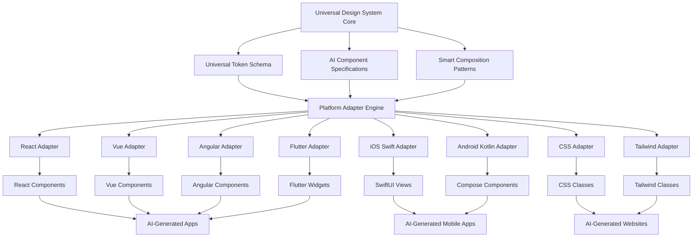

# Universal Design System Transformation Plan

## 🎯 **Executive Summary**

Transform the existing Xala UI System v5.0.1 from a React-focused design system into a **Universal, AI-Friendly Single Source of Truth** that works seamlessly across all platforms, frameworks, and technologies while being optimized for AI code generation tools.

## 🚀 **Vision Statement**

Create a design system so intelligent and well-designed that:

1. **AI Code Generation Tools** can immediately understand how to create stunning, professional designs
2. **Single Source of Truth** - one design system adapts to React, Vue, Angular, React Native, Flutter, iOS, Android
3. **Auto-Stunning Designs** - components automatically create professional layouts with zero configuration
4. **Multi-Purpose & Multi-Technology** - works for dashboards, marketing sites, mobile apps, desktop applications

## 📊 **Current System Analysis**

### **Strengths (v5.0.1)**
- ✅ Comprehensive JSON theme templates (20+ production-ready themes)
- ✅ Solid token architecture with semantic layers
- ✅ 100+ UI components with professional sizing
- ✅ WCAG 2.2 AAA accessibility compliance
- ✅ Norwegian compliance (NSM, GDPR)
- ✅ SSR-safe architecture
- ✅ Multi-platform foundation (desktop, mobile, tablet)

### **Transformation Requirements**
- 🔄 Platform-agnostic component specifications
- 🔄 AI-optimized component APIs and naming
- 🔄 Universal token transformation system
- 🔄 Smart default composition patterns
- 🔄 Automatic layout generation
- 🔄 Framework-specific adapters
- 🔄 Documentation optimized for AI consumption

## 🏗 **Universal Architecture Overview**



## 📋 **Implementation Phases**

### **Phase 1: Universal Foundation (COMPLETED)**
- [x] **Universal Token Schema** - Platform-agnostic JSON schema
- [x] **AI Component Specifications** - Semantic, predictable component APIs
- [x] **Platform Adapter Engine** - Automatic code generation for all platforms

### **Phase 2: Smart Composition System**
- [ ] **Smart Composition Patterns** - Auto-professional layouts
- [ ] **Layout Generation Engine** - Intelligent responsive patterns
- [ ] **AI Integration Layer** - Optimized for code generation tools

### **Phase 3: Platform Implementation**
- [ ] **Complete Framework Adapters** - React, Vue, Angular, Svelte
- [ ] **Mobile Platform Adapters** - React Native, Flutter, iOS, Android
- [ ] **Styling System Adapters** - CSS, Tailwind, Styled Components, Emotion

### **Phase 4: AI Optimization**
- [ ] **AI Documentation Structure** - Patterns, examples, guides
- [ ] **Code Generation Templates** - Pre-built AI-optimized patterns
- [ ] **Testing & Validation** - Cross-platform compatibility testing

## 🎨 **Key Innovations**

### **1. Universal Token Schema**
- **Platform-Agnostic**: Works across all frameworks and platforms
- **AI-Friendly**: Semantic naming that AI tools understand
- **Comprehensive**: Covers all design properties with smart defaults
- **Extensible**: Easy to add new platforms and customizations

### **2. AI Component Specifications**
- **Semantic Naming**: Components named for AI understanding (Button, Card, Input)
- **Smart Defaults**: Professional designs with zero configuration
- **Predictable APIs**: Consistent prop patterns across all components
- **Composition Rules**: Clear guidelines for component combinations

### **3. Platform Adapter Engine**
- **Automatic Code Generation**: Transform universal specs to platform-specific code
- **Framework-Specific Optimization**: Adapts to each platform's best practices
- **AI Recommendations**: Provides platform-specific guidance for AI tools
- **Real-Time Transformation**: Generate code on-demand for any platform

### **4. Smart Composition Patterns**
- **Auto-Layout Generation**: Intelligent responsive layouts
- **Professional Defaults**: Stunning designs automatically
- **Context-Aware**: Adapts based on use case (dashboard, form, landing page)
- **AI-Optimized**: Patterns designed for AI code generation

## 🔧 **Technical Implementation**

### **Universal Token Schema Structure**
```json
{
  "id": "universal-theme",
  "tokens": {
    "primitive": { /* Raw values */ },
    "semantic": { /* Contextual meanings */ },
    "component": { /* Component-specific */ }
  },
  "components": {
    "Button": { /* Universal component spec */ },
    "Card": { /* Universal component spec */ }
  },
  "composition": {
    "layouts": { /* Smart layout patterns */ },
    "patterns": { /* Composition rules */ }
  },
  "aiContext": {
    "designIntent": "professional",
    "useCases": ["dashboard", "form", "landing-page"]
  }
}
```

### **Platform Adapter Engine Usage**
```typescript
// AI Tool Usage Example
const adapter = new PlatformAdapterEngine();

// Transform entire system to React
const reactSystem = await adapter.transformToTarget(universalSystem, 'react');

// Generate specific component for Vue
const vueButton = await adapter.generateComponent(buttonSpec, 'vue', { 
  variant: 'primary', 
  size: 'lg' 
});

// Get AI recommendations for Flutter
const flutterTips = adapter.getAIRecommendations('flutter');
```

### **AI-Optimized Component Usage**
```typescript
// React Example - AI can generate this easily
<Container size="lg">
  <Stack direction="vertical" gap="xl">
    <Text variant="h1">Dashboard</Text>
    <Grid cols={{ base: 1, md: 3 }} gap="lg">
      <Card><Text variant="h3">Revenue</Text></Card>
      <Card><Text variant="h3">Users</Text></Card>
      <Card><Text variant="h3">Growth</Text></Card>
    </Grid>
  </Stack>
</Container>

// Vue Example - Same semantic structure
<Container size="lg">
  <Stack direction="vertical" gap="xl">
    <Text variant="h1">Dashboard</Text>
    <Grid :cols="{ base: 1, md: 3 }" gap="lg">
      <Card><Text variant="h3">Revenue</Text></Card>
      <Card><Text variant="h3">Users</Text></Card>
      <Card><Text variant="h3">Growth</Text></Card>
    </Grid>
  </Stack>
</Container>

// Flutter Example - Automatically adapted
Column(
  children: [
    Text('Dashboard', style: Theme.of(context).textTheme.headlineLarge),
    SizedBox(height: 32),
    GridView.count(
      crossAxisCount: 3,
      children: [
        Card(child: Text('Revenue')),
        Card(child: Text('Users')),
        Card(child: Text('Growth')),
      ],
    ),
  ],
)
```

## 🤖 **AI Integration Strategy**

### **For AI Code Generation Tools**
1. **Semantic Component Names** - Obvious, intuitive naming
2. **Predictable Prop Patterns** - Consistent APIs across components
3. **Smart Defaults** - Professional designs with minimal props
4. **Composition Examples** - Clear patterns for component combinations
5. **Platform Recommendations** - Best practices for each target platform

### **For AI Development Workflows**
1. **Universal Specifications** - Single source of truth for all platforms
2. **Automatic Code Generation** - Transform specs to any platform instantly
3. **Context-Aware Suggestions** - Recommendations based on use case
4. **Professional Defaults** - Always generates stunning, accessible designs

## 📚 **Documentation Strategy**

### **AI-Optimized Documentation Structure**
1. **Component Specifications** - Clear, searchable component definitions
2. **Pattern Library** - Pre-built layouts and compositions
3. **Platform Guides** - Framework-specific implementation guides
4. **Code Examples** - AI-ready snippets for every use case
5. **Best Practices** - Professional design guidelines

### **MCP Server Integration**
- **Automatic Documentation Generation** - Keep docs in sync with specs
- **Interactive Examples** - Live code generation and preview
- **AI Training Data** - Optimized examples for AI model training
- **Version Management** - Track changes and migrations

## 🎯 **Success Metrics**

### **For AI Tools**
- ⚡ **Generation Speed**: AI can create professional layouts in seconds
- 🎨 **Design Quality**: Generated designs meet professional standards
- 🔄 **Cross-Platform**: Same prompt works across all platforms
- ♿ **Accessibility**: Generated code meets WCAG 2.2 AAA standards

### **For Developers**
- 📈 **Development Velocity**: 50% faster component development
- 🎨 **Design Consistency**: Automatic adherence to design system
- 🌐 **Platform Support**: Single codebase, multiple platform outputs
- 📱 **Responsive Design**: Automatic mobile-first responsive layouts

### **For Organizations**
- 💰 **Cost Reduction**: Reduced design and development overhead
- ⚡ **Time to Market**: Faster prototype to production cycles
- 🎯 **Brand Consistency**: Unified design language across all platforms
- 🔒 **Compliance**: Built-in accessibility and regulatory compliance

## 🚀 **Getting Started**

### **For AI Development Tools**
```bash
# Install universal design system
npm install @xala-technologies/universal-design-system

# Generate React app
ai-tool generate app --framework react --template dashboard

# Generate Flutter app  
ai-tool generate app --framework flutter --template dashboard

# Generate Vue app
ai-tool generate app --framework vue --template dashboard
```

### **For Developers**
```typescript
import { PlatformAdapterEngine } from '@xala-technologies/universal-design-system';

// Transform universal system to your platform
const adapter = new PlatformAdapterEngine();
const myPlatform = await adapter.transformToTarget(universalSystem, 'react');

// Use generated components
import { Button, Card, Container } from './generated/components';
```

### **For Organizations**
1. **Adopt Universal System** - Single source of truth for all projects
2. **Train AI Tools** - Use documentation and examples for AI training
3. **Implement Gradually** - Start with new projects, migrate existing ones
4. **Scale Globally** - Deploy across all platforms and teams

## 🔮 **Future Roadmap**

### **Q1 2024: Foundation**
- Complete platform adapter implementations
- AI documentation and training materials
- Initial AI tool integrations

### **Q2 2024: Enhancement**
- Advanced composition patterns
- Machine learning-powered design suggestions
- Performance optimizations

### **Q3 2024: Expansion**
- Additional platform support (Desktop apps, Web components)
- Industry-specific theme templates
- Advanced accessibility features

### **Q4 2024: Intelligence**
- AI-powered design system evolution
- Automatic component generation from designs
- Predictive design optimization

## 📞 **Support & Resources**

- **Documentation**: `/docs/universal-system/`
- **Examples**: `/examples/ai-generated/`
- **MCP Server**: `/mcp-servers/universal-design-system/`
- **Community**: GitHub Discussions
- **Enterprise Support**: Contact Xala Technologies

---

**This transformation represents the future of design systems - intelligent, universal, and AI-native. By implementing this plan, we create a design system that doesn't just support AI tools, but is designed from the ground up to work seamlessly with them, creating stunning professional designs across all platforms with unprecedented ease and consistency.**