# Xala UI CLI - Architecture Diagrams

## System Architecture Overview

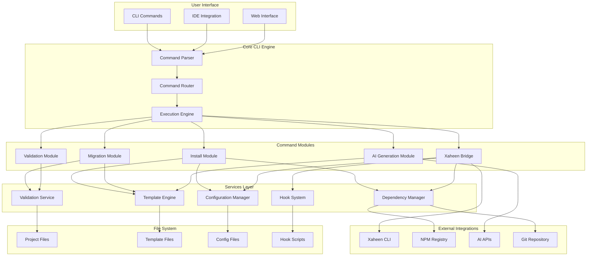

## Data Flow Architecture

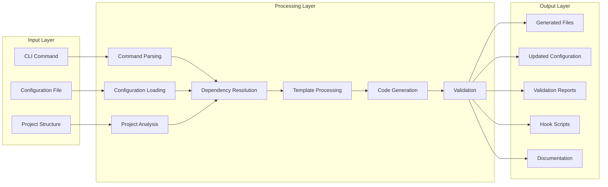

## Migration System Architecture

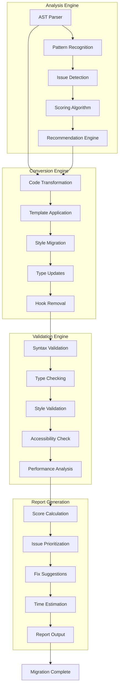

## Xaheen Integration Architecture

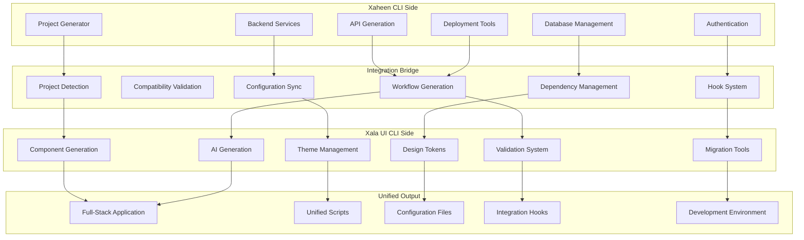

## Configuration Management Flow

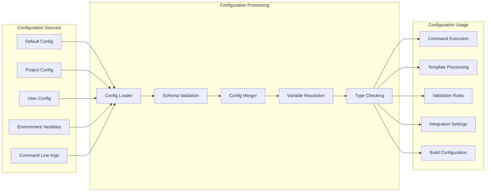

## Dependency Resolution System

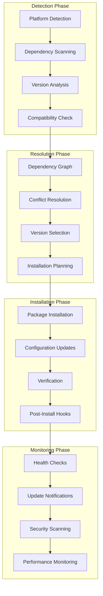

## Template System Architecture

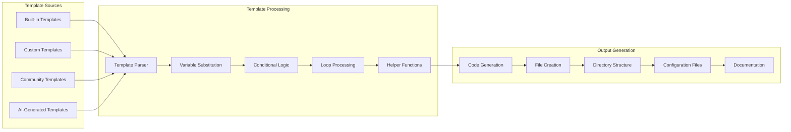

## Hook System Architecture

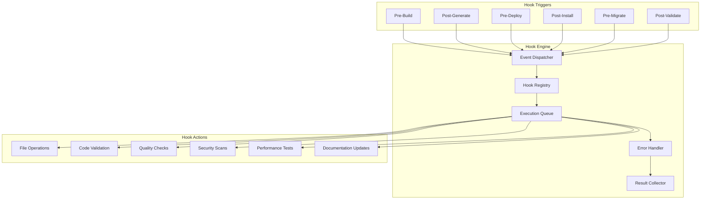

## AI Generation Pipeline

```mermaid
graph LR
    subgraph "Input Processing"
        A[Natural Language Input]
        B[Context Analysis]
        C[Intent Recognition]
        D[Parameter Extraction]
    end
    
    subgraph "Model Selection"
        E[Model Size Detection]
        F[Capability Assessment]
        G[Prompt Optimization]
        H[Context Preparation]
    end
    
    subgraph "Generation Phase"
        I[API Request]
        J[Response Processing]
        K[Code Parsing]
        L[Template Application]
    end
    
    subgraph "Post-Processing"
        M[Code Validation]
        N[Style Application]
        O[Integration Checks]
        P[Quality Assurance]
    end
    
    A --> B
    B --> C
    C --> D
    D --> E
    
    E --> F
    F --> G
    G --> H
    H --> I
    
    I --> J
    J --> K
    K --> L
    L --> M
    
    M --> N
    N --> O
    O --> P
```

## Security & Compliance Architecture

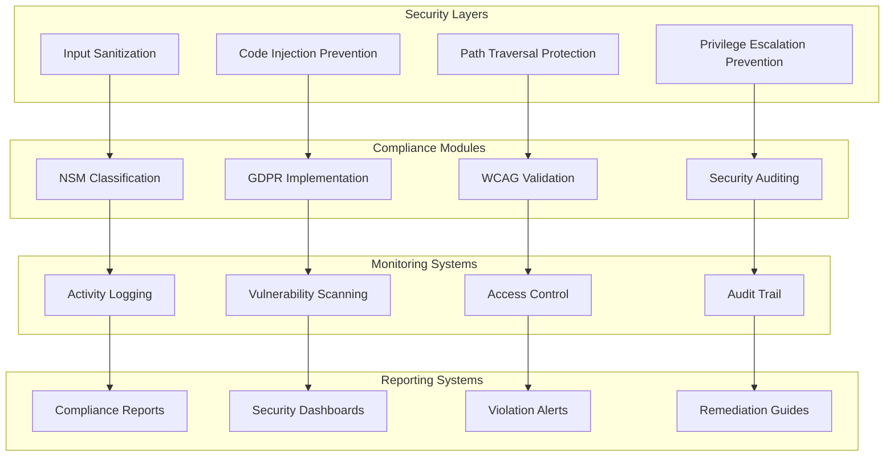

## Error Handling & Recovery

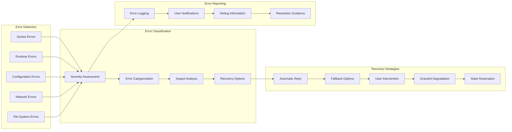

## Performance Optimization Architecture

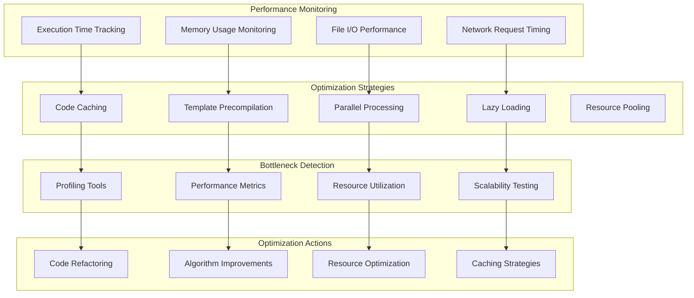

## Testing Architecture

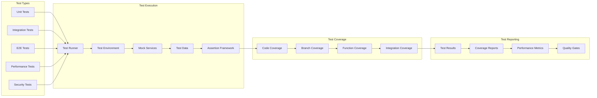

## Deployment Architecture

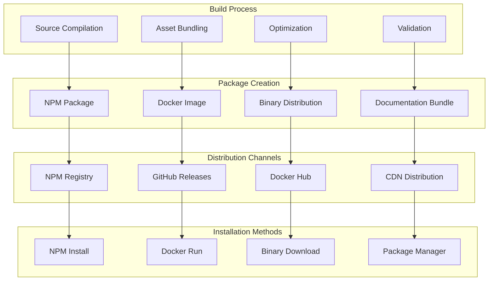

These architecture diagrams provide a comprehensive visual representation of the Xala UI CLI system, showing how all components interact and data flows through the system. Each diagram focuses on a specific aspect of the architecture, making it easier to understand the complex relationships and dependencies within the system.