# Xala UI CLI - Comprehensive Guide

## Table of Contents

1. [Overview](#overview)
2. [Latest Functionalities](#latest-functionalities)
3. [Installation & Migration Commands](#installation--migration-commands)
4. [Xaheen Integration System](#xaheen-integration-system)
5. [Architecture Deep Dive](#architecture-deep-dive)
6. [Configuration Management](#configuration-management)
7. [Dependency Management](#dependency-management)
8. [Workflow Automation](#workflow-automation)
9. [Compliance & Security](#compliance--security)
10. [Advanced Usage](#advanced-usage)
11. [Troubleshooting](#troubleshooting)
12. [API Reference](#api-reference)

---

## Overview

The Xala UI CLI has evolved into a comprehensive design system management tool that provides:

- **Auto-installation** in existing applications
- **Migration analysis** and automated code conversion
- **Component validation** with scoring and recommendations
- **Full-stack integration** with Xaheen CLI
- **Enterprise compliance** (NSM, GDPR, WCAG AAA)
- **Multi-platform support** (React, Vue, Angular, Next.js, Nuxt)
- **AI-powered development** optimized for different LLM sizes

---

## Latest Functionalities

### 1. Installation & Setup Commands

#### `xala install` - Auto-Installation System

**Purpose**: Automatically install and configure the Xala UI system in existing or new applications.

```bash
xala install [options]

Options:
  -f, --force                    Force installation even if conflicts detected
  --skip-deps                    Skip dependency installation
  -t, --template <template>      Project template (saas, healthcare, finance, etc.)
  -i, --industry <industry>      Industry preset (healthcare, finance, government, etc.)
  -p, --platform <platform>      Platform (react, nextjs, vue, nuxt, angular)
  --theme <theme>                Default theme to apply
  -c, --compliance <compliance>   Compliance preset (nsm, gdpr, healthcare, finance)
  --backup                       Create backup before installation
```

**Installation Process Flow:**

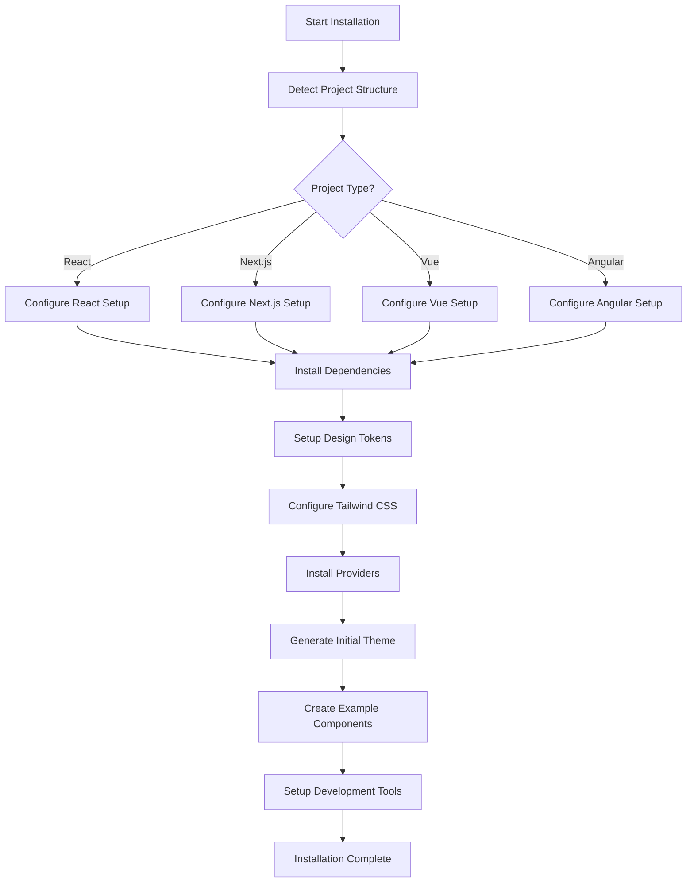

**Example Usage:**

```bash
# Basic installation in React project
xala install --platform react

# Healthcare application with HIPAA compliance
xala install --template healthcare --compliance hipaa --theme healthcare

# Enterprise SaaS with Norwegian compliance
xala install --template saas --compliance nsm,gdpr --industry enterprise
```

#### `xala migrate` - Migration Analysis & Conversion

**Purpose**: Analyze existing codebases and migrate them to the Xala UI system standards.

```bash
# Analyze existing code
xala migrate analyze [path] [options]

# Convert components to UI system
xala migrate convert <file> [options]

# Quick compatibility check  
xala check <file> [options]
```

**Migration Analysis Architecture:**

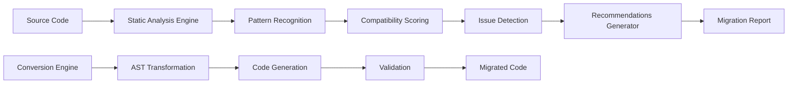

**Analysis Categories:**

1. **v5.0 Architecture Compliance**
   - Detects hooks in UI components
   - Validates CVA usage
   - Checks ref forwarding patterns

2. **Styling Analysis**
   - Identifies inline styles
   - Detects hardcoded colors
   - Validates professional sizing

3. **TypeScript Compliance**
   - Finds `any` types
   - Validates interface definitions
   - Checks readonly modifiers

4. **Accessibility Validation**
   - ARIA label compliance
   - Image alt text validation
   - Semantic HTML usage

5. **Performance Analysis**
   - Component memoization
   - Object creation patterns
   - Bundle size impact

**Migration Report Example:**

```json
{
  "file": "src/components/Button.tsx",
  "overallScore": 75,
  "status": "good",
  "issues": [
    {
      "category": "architecture",
      "severity": "warning",
      "message": "Component uses useState hook",
      "line": 12,
      "suggestion": "Move state to parent component"
    }
  ],
  "recommendations": [
    {
      "priority": "high",
      "action": "Convert to CVA pattern",
      "effort": "moderate"
    }
  ],
  "estimatedTime": "30-60 minutes"
}
```

### 2. Component Validation System

#### `xala check` - Quick Component Validation

**Purpose**: Validate individual components against UI system standards with detailed scoring.

```bash
xala check <file> [options]

Options:
  -v, --verbose              Show detailed information
  -f, --fix-suggestions      Show specific fix commands
  --json                     Output as JSON
  --score-only              Show only the compatibility score
```

**Validation Scoring System:**

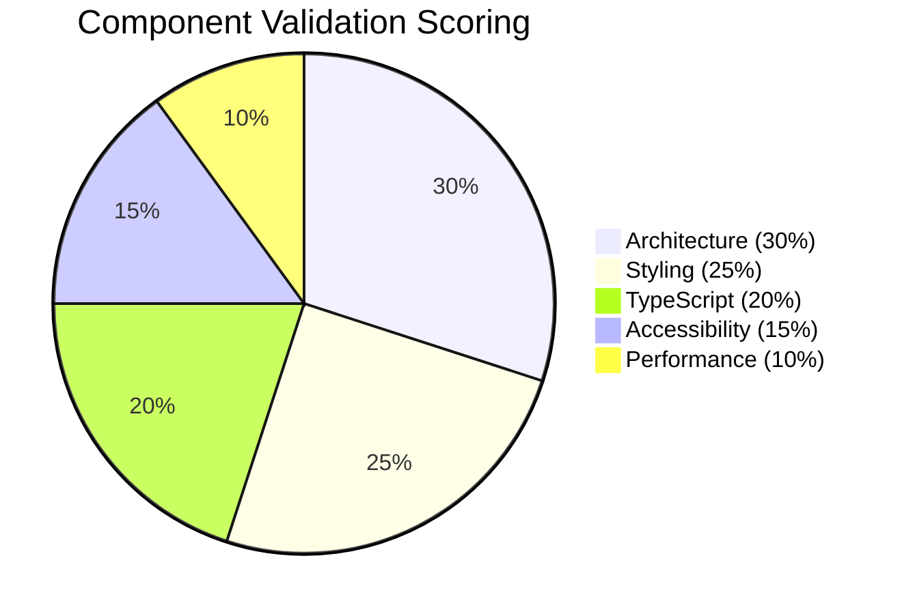

**Scoring Criteria:**

| Score Range | Status | Description |
|-------------|--------|-------------|
| 90-100 | Excellent | Fully compliant with all standards |
| 75-89 | Good | Minor improvements needed |
| 50-74 | Needs Work | Several issues to address |
| 0-49 | Requires Migration | Significant work required |

**Validation Output Example:**

```bash
🎉 EXCELLENT - Score: 92%
⏱️  Estimated fix time: 0 minutes

📊 Results Summary:
   ✅ Passed: 11
   ❌ Failed: 1
   🟡 Warnings: 2

📋 Detailed Results:
✅ v5.0 Pure Components: Component follows v5.0 pure component pattern
✅ CVA Pattern: Using CVA for variant management
✅ TypeScript Strictness: No "any" types found
⚠️  Professional Sizing: Consider using larger sizes for better UX

🎯 Recommendations:
   👍 Good work! Just a few minor improvements needed.
   🔧 Run: xala migrate convert --interactive
```

---

## Xaheen Integration System

### Architecture Overview

The Xaheen integration creates a unified full-stack development experience by bridging the Xala UI CLI with the Xaheen full-stack CLI.

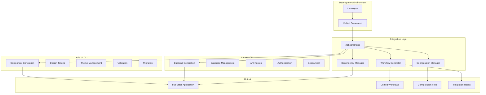

### Integration Commands

#### `xala xaheen init` - Initialize Integration

**Purpose**: Set up Xala UI system within an existing Xaheen project.

```bash
xala xaheen init [options]

Options:
  -t, --theme <theme>           UI theme (enterprise, healthcare, finance)
  -i, --industry <industry>     Industry preset
  -c, --compliance <list>       Compliance requirements (nsm,gdpr,hipaa,sox)
  --components <list>           Initial components to generate
  --skip-ui-setup              Skip initial UI setup
  --interactive                 Interactive setup mode
```

**Integration Process:**

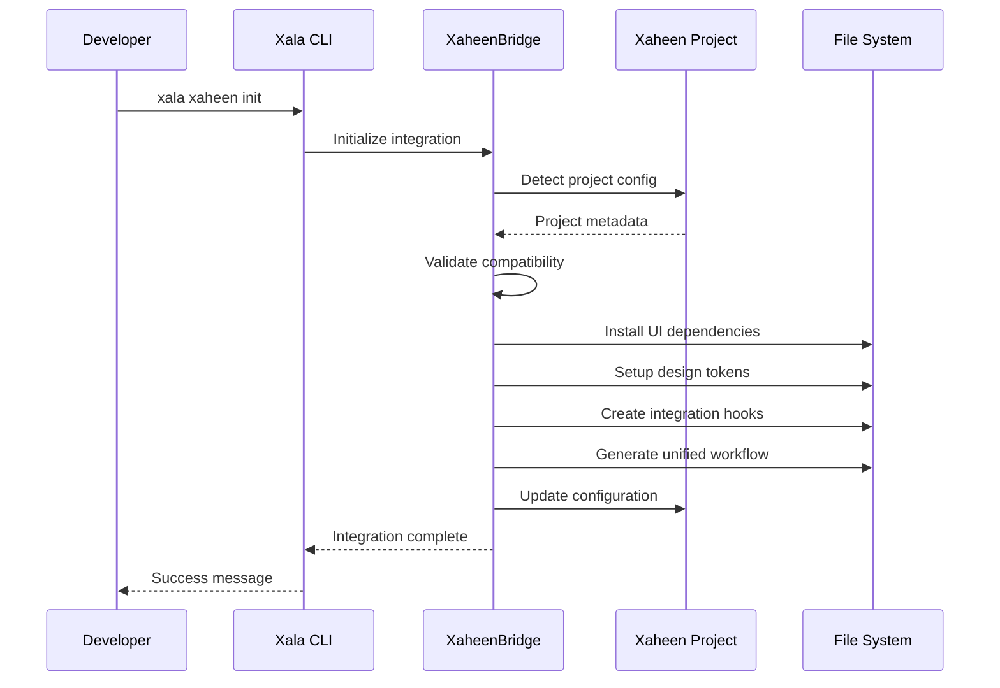

#### `xala xaheen sync` - Synchronize Changes

**Purpose**: Sync UI components with backend API changes.

```bash
xala xaheen sync [options]

Options:
  -f, --force    Force sync even with conflicts
```

**Sync Process:**

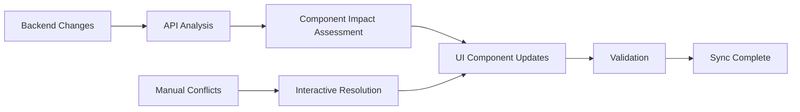

### Generated Project Structure

When integration is complete, the project structure becomes:

```
my-saas-app/
├── .xaheen/                    # Integration directory
│   ├── hooks/                  # Automation hooks
│   │   ├── pre-build.sh       # UI validation before build
│   │   ├── post-generate.sh   # Apply UI to new components
│   │   └── pre-deployment.sh  # Final checks before deploy
│   ├── ui-validation-report.json  # Latest validation results
│   └── last-generation        # Timestamp for incremental processing
│
├── src/                        # Application source
│   ├── components/            # UI components (Xala managed)
│   │   ├── ui/               # Base UI components
│   │   ├── forms/            # Form components
│   │   ├── layout/           # Layout components
│   │   └── features/         # Feature-specific components
│   ├── pages/                # Frontend pages/routes
│   ├── api/                  # API routes (Xaheen managed)
│   ├── lib/                  # Shared utilities
│   └── styles/               # Global styles and themes
│
├── server/                     # Backend services (Xaheen managed)
│   ├── controllers/           # API controllers
│   ├── services/             # Business logic
│   ├── models/               # Data models
│   └── middleware/           # Express middleware
│
├── config/                     # Configuration files
│   ├── database.config.js    # Database configuration
│   ├── auth.config.js        # Authentication setup
│   └── tailwind.config.js    # Tailwind CSS configuration
│
├── xala.config.json           # UI system configuration
├── xaheen.config.json         # Full-stack configuration
├── xaheen-xala.sh            # Unified development workflow
├── package.json              # Dependencies and scripts
└── README.md                 # Project documentation
```

### Unified Workflow Script

The generated `xaheen-xala.sh` script provides unified commands:

```bash
#!/bin/bash
# Unified Xaheen + Xala Development Workflow

# Generate full-stack features
if [ "$1" = "generate" ] && [ "$2" = "fullstack" ]; then
    echo "🏗️ Generating full stack feature: $3"
    xaheen generate:feature $3
    xala ai generate "UI components for $3 feature"
    xala migrate convert src/components/$3 --interactive
fi

# Development server with UI watching
if [ "$1" = "dev" ]; then
    echo "🔄 Starting unified development servers..."
    concurrently \
        "xaheen dev:backend" \
        "xaheen dev:frontend" \
        "xala dev --watch"
fi

# Build with UI validation
if [ "$1" = "build" ]; then
    echo "📦 Building with UI validation..."
    xala migrate analyze --report
    if [ $? -eq 0 ]; then
        xaheen build
    else
        echo "❌ Build failed: UI validation errors"
        exit 1
    fi
fi
```

**Usage Examples:**

```bash
# Start unified development environment
./xaheen-xala.sh dev

# Generate a complete user management system
./xaheen-xala.sh generate fullstack UserManagement
# This creates:
# - Backend: User model, controller, routes, middleware
# - Frontend: UserList, UserForm, UserProfile components
# - Database: User table, migrations, seeds
# - API: CRUD endpoints with validation
# - UI: Forms, tables, modals with design system

# Build for production with validation
./xaheen-xala.sh build
```

---

## Architecture Deep Dive

### Component Architecture (v5.0)

The latest CLI enforces v5.0 architecture principles:

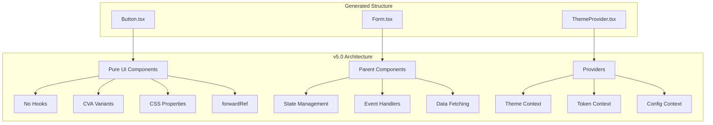

**v5.0 Component Example:**

```typescript
// ✅ v5.0 Pure Component Pattern
import React from 'react';
import { cva, type VariantProps } from 'class-variance-authority';
import { cn } from '@/lib/utils';

const buttonVariants = cva(
  // Base styles
  [
    'inline-flex',
    'items-center',
    'justify-center',
    'rounded-lg',
    'text-sm',
    'font-medium',
    'transition-colors',
    'focus-visible:outline-none',
    'focus-visible:ring-2',
    'focus-visible:ring-offset-2',
    'disabled:pointer-events-none',
    'disabled:opacity-50'
  ],
  {
    variants: {
      variant: {
        primary: [
          'bg-primary',
          'text-primary-foreground',
          'hover:bg-primary/90'
        ],
        secondary: [
          'bg-secondary',
          'text-secondary-foreground',
          'hover:bg-secondary/80'
        ],
        outline: [
          'border',
          'border-input',
          'bg-background',
          'hover:bg-accent',
          'hover:text-accent-foreground'
        ],
        ghost: [
          'hover:bg-accent',
          'hover:text-accent-foreground'
        ],
        destructive: [
          'bg-destructive',
          'text-destructive-foreground',
          'hover:bg-destructive/90'
        ]
      },
      size: {
        sm: ['h-9', 'px-3'],
        md: ['h-10', 'px-4', 'py-2'],
        lg: ['h-11', 'px-8'],
        xl: ['h-12', 'px-10'],
        icon: ['h-10', 'w-10']
      }
    },
    defaultVariants: {
      variant: 'primary',
      size: 'md'
    }
  }
);

export interface ButtonProps
  extends React.ButtonHTMLAttributes<HTMLButtonElement>,
    VariantProps<typeof buttonVariants> {
  readonly loading?: boolean;
  readonly icon?: React.ReactNode;
}

export const Button = React.forwardRef<HTMLButtonElement, ButtonProps>(
  ({ className, variant, size, loading, icon, children, disabled, ...props }, ref) => {
    return (
      <button
        className={cn(buttonVariants({ variant, size }), className)}
        ref={ref}
        disabled={disabled || loading}
        aria-busy={loading}
        {...props}
      >
        {loading && (
          <svg
            className="animate-spin -ml-1 mr-2 h-4 w-4"
            xmlns="http://www.w3.org/2000/svg"
            fill="none"
            viewBox="0 0 24 24"
            aria-hidden="true"
          >
            <circle
              className="opacity-25"
              cx="12"
              cy="12"
              r="10"
              stroke="currentColor"
              strokeWidth="4"
            />
            <path
              className="opacity-75"
              fill="currentColor"
              d="M4 12a8 8 0 018-8V0C5.373 0 0 5.373 0 12h4zm2 5.291A7.962 7.962 0 014 12H0c0 3.042 1.135 5.824 3 7.938l3-2.647z"
            />
          </svg>
        )}
        {icon && <span className="mr-2">{icon}</span>}
        {children}
      </button>
    );
  }
);

Button.displayName = 'Button';
```

### Integration Bridge Architecture

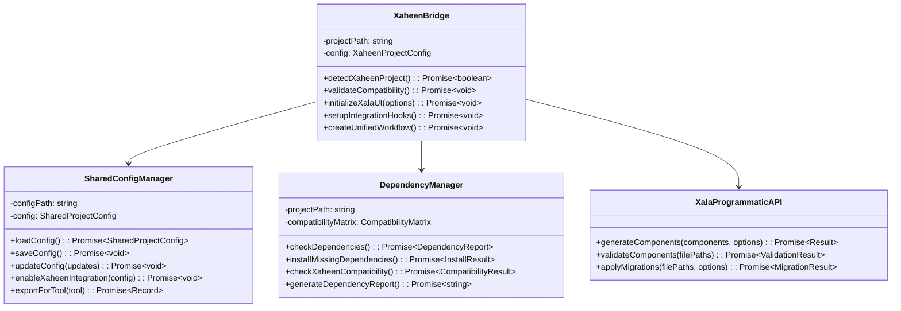

---

## Configuration Management

### Unified Configuration Schema

```typescript
interface SharedProjectConfig {
  // Project identification
  name: string;
  version: string;
  type: 'standalone' | 'xaheen-integrated' | 'custom';
  
  // UI System configuration
  ui: {
    system: 'xala';
    version: string;
    theme: string;
    platform: 'react' | 'nextjs' | 'vue' | 'nuxt' | 'angular';
    compliance: string[];
    customizations: Record<string, any>;
  };
  
  // Integration settings
  integrations: {
    xaheen?: {
      enabled: boolean;
      version: string;
      features: string[];
      autoSync: boolean;
      hooks: {
        preBuild?: string;
        postGenerate?: string;
        preDeployment?: string;
      };
    };
    storybook?: { enabled: boolean; version: string };
    figma?: { enabled: boolean; token?: string };
  };
  
  // Development settings
  development: {
    hotReload: boolean;
    linting: boolean;
    testing: boolean;
    accessibility: boolean;
  };
  
  // Compliance and standards
  compliance: {
    norwegian: boolean;
    gdpr: boolean;
    wcag: 'A' | 'AA' | 'AAA';
    security: {
      csp: boolean;
      sanitization: boolean;
      audit: boolean;
    };
  };
}
```

### Configuration Flow

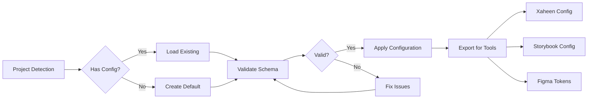

**Configuration Examples:**

```json
{
  "name": "healthcare-saas",
  "version": "1.0.0",
  "type": "xaheen-integrated",
  "ui": {
    "system": "xala",
    "version": "1.0.0",
    "theme": "healthcare",
    "platform": "nextjs",
    "compliance": ["hipaa", "wcag-aaa"],
    "customizations": {
      "primaryColor": "#0066cc",
      "fontFamily": "Inter",
      "borderRadius": "8px"
    }
  },
  "integrations": {
    "xaheen": {
      "enabled": true,
      "version": "1.0.0",
      "features": ["auth", "dashboard", "patients"],
      "autoSync": true,
      "hooks": {
        "preBuild": ".xaheen/hooks/pre-build.sh",
        "postGenerate": ".xaheen/hooks/post-generate.sh"
      }
    }
  },
  "development": {
    "hotReload": true,
    "linting": true,
    "testing": true,
    "accessibility": true
  },
  "compliance": {
    "norwegian": false,
    "gdpr": true,
    "wcag": "AAA",
    "security": {
      "csp": true,
      "sanitization": true,
      "audit": true
    }
  }
}
```

---

## Dependency Management

### Compatibility Matrix

The system maintains a comprehensive compatibility matrix:

```typescript
interface CompatibilityMatrix {
  xaheen: {
    [version: string]: {
      xalaUI: string[];      // Compatible Xala UI versions
      node: string;          // Required Node.js version
      npm: string;           // Required npm version
      platforms: string[];   // Supported platforms
    };
  };
  platforms: {
    [platform: string]: {
      xalaUI: string[];      // Compatible Xala UI versions
      dependencies: string[]; // Required dependencies
    };
  };
}
```

**Example Matrix:**

```json
{
  "xaheen": {
    "1.0.0": {
      "xalaUI": ["1.0.0", "1.1.0"],
      "node": ">=18.0.0",
      "npm": ">=8.0.0",
      "platforms": ["react", "nextjs", "vue", "nuxt", "angular"]
    },
    "2.0.0": {
      "xalaUI": ["1.2.0", "2.0.0"],
      "node": ">=20.0.0",
      "npm": ">=9.0.0",
      "platforms": ["react", "nextjs", "vue", "nuxt", "angular", "svelte", "solid"]
    }
  },
  "platforms": {
    "react": {
      "xalaUI": ["1.0.0", "1.1.0", "1.2.0", "2.0.0"],
      "dependencies": ["react@>=17.0.0", "react-dom@>=17.0.0"]
    },
    "nextjs": {
      "xalaUI": ["1.0.0", "1.1.0", "1.2.0", "2.0.0"],
      "dependencies": ["next@>=13.0.0", "react@>=17.0.0", "react-dom@>=17.0.0"]
    }
  }
}
```

### Dependency Check Process

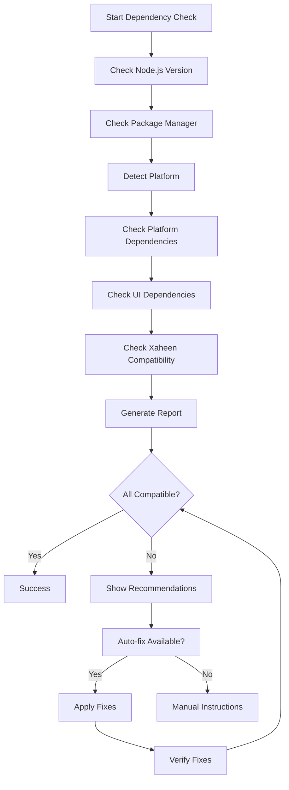

**Dependency Report Example:**

```bash
# Dependency Report

## Overall Status: ❌ Issues Found

## Dependencies

| Name | Required | Installed | Minimum | Compatible |
|------|----------|-----------|---------|------------|
| Node.js | ✅ | v18.17.0 | v18.0.0 | ✅ |
| npm | ✅ | v9.6.7 | v8.0.0 | ✅ |
| react | ✅ | v18.2.0 | v17.0.0 | ✅ |
| @xaheen/cli | ✅ | Not installed | v1.0.0 | ❌ |
| tailwindcss | ✅ | v3.3.0 | v3.0.0 | ✅ |

## Recommendations

- ⚠️ Some dependencies are incompatible or missing:
  - @xaheen/cli: not installed (requires v1.0.0)
    Install: npm install -g @xaheen/cli@latest
```

---

## Workflow Automation

### Hook System Architecture

The CLI implements a comprehensive hook system for automation:

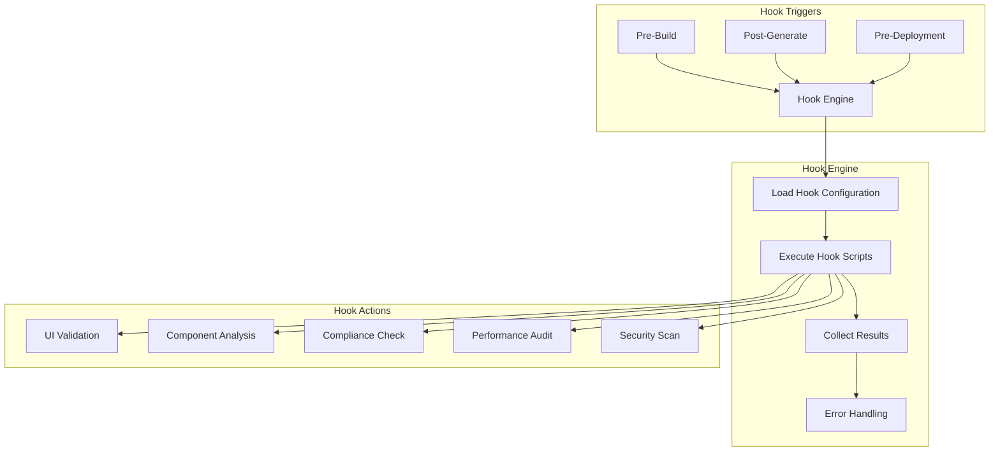

### Pre-Build Hook

```bash
#!/bin/bash
# Pre-Build Hook: UI Validation

echo "🎨 Validating UI components before build..."

# 1. Run component validation
xala migrate analyze --report --format json > .xaheen/ui-validation-report.json
VALIDATION_EXIT_CODE=$?

# 2. Check for critical issues
if [ $VALIDATION_EXIT_CODE -ne 0 ]; then
    echo "❌ UI validation failed with critical issues"
    echo "📄 See report: .xaheen/ui-validation-report.json"
    echo "🔧 Run: xala check src/components/ --fix-suggestions"
    exit 1
fi

# 3. Check validation score
SCORE=$(jq '.overallScore' .xaheen/ui-validation-report.json)
MIN_SCORE=75

if [ $SCORE -lt $MIN_SCORE ]; then
    echo "⚠️  UI validation score ($SCORE%) below minimum ($MIN_SCORE%)"
    echo "🔧 Consider running: xala migrate convert --interactive"
    # Don't fail build, but warn
fi

# 4. Check for TypeScript errors
echo "🔍 Checking TypeScript compliance..."
npx tsc --noEmit
if [ $? -ne 0 ]; then
    echo "❌ TypeScript compilation failed"
    exit 1
fi

# 5. Run accessibility audit
echo "♿ Running accessibility audit..."
xala check src/components/ --accessibility-only
if [ $? -ne 0 ]; then
    echo "⚠️  Accessibility issues found - please review"
    # Don't fail build for accessibility warnings
fi

echo "✅ UI validation completed successfully"
echo "📊 Validation score: $SCORE%"
```

### Post-Generate Hook

```bash
#!/bin/bash
# Post-Generate Hook: Apply UI System

echo "🎨 Applying UI system to newly generated components..."

# 1. Find components newer than last generation
LAST_GEN_FILE=".xaheen/last-generation"
if [ ! -f "$LAST_GEN_FILE" ]; then
    touch "$LAST_GEN_FILE"
fi

# 2. Find new component files
NEW_COMPONENTS=$(find src/components -name "*.tsx" -newer "$LAST_GEN_FILE")

if [ -z "$NEW_COMPONENTS" ]; then
    echo "ℹ️  No new components found"
    exit 0
fi

echo "🔍 Found new components:"
echo "$NEW_COMPONENTS"

# 3. Apply UI system to each new component
for component in $NEW_COMPONENTS; do
    echo "🔧 Processing: $component"
    
    # Check current state
    SCORE=$(xala check "$component" --score-only)
    echo "   Current score: $SCORE%"
    
    # If score is low, attempt auto-migration
    if [ $SCORE -lt 60 ]; then
        echo "   🔄 Auto-migrating component..."
        xala migrate convert "$component" --backup --auto-fix
        
        # Check new score
        NEW_SCORE=$(xala check "$component" --score-only)
        echo "   ✅ New score: $NEW_SCORE%"
    else
        echo "   ✅ Component meets standards"
    fi
done

# 4. Update timestamp
touch "$LAST_GEN_FILE"

# 5. Generate updated component index
echo "📝 Updating component exports..."
echo "// Auto-generated component exports" > src/components/index.ts
find src/components -name "*.tsx" -not -path "*/index.tsx" | while read -r file; do
    COMPONENT=$(basename "$file" .tsx)
    RELATIVE_PATH=$(realpath --relative-to=src/components "$file" | sed 's/\.tsx$//')
    echo "export { $COMPONENT } from './$RELATIVE_PATH';" >> src/components/index.ts
done

echo "✅ UI system applied to all new components"
```

### Package.json Integration

The system automatically adds or updates package.json scripts:

```json
{
  "scripts": {
    "dev": "./xaheen-xala.sh dev",
    "build": "./xaheen-xala.sh build",
    "test": "jest",
    "lint": "eslint src/ --ext .ts,.tsx",
    "type-check": "tsc --noEmit",
    
    "ui:check": "xala check src/components/ --verbose",
    "ui:migrate": "xala migrate analyze --report",
    "ui:dev": "xala dev --watch",
    "ui:validate": "xala migrate analyze --report --format html",
    
    "xaheen:backend": "xaheen dev:backend",
    "xaheen:frontend": "xaheen dev:frontend",
    
    "dev:unified": "concurrently \"npm run xaheen:backend\" \"npm run xaheen:frontend\" \"npm run ui:dev\"",
    "build:unified": "npm run ui:validate && xaheen build",
    
    "generate:component": "xala ai generate",
    "generate:feature": "./xaheen-xala.sh generate fullstack",
    "generate:page": "./xaheen-xala.sh generate frontend"
  }
}
```

---

## Compliance & Security

### Norwegian Compliance Integration

The CLI provides built-in support for Norwegian regulatory requirements:

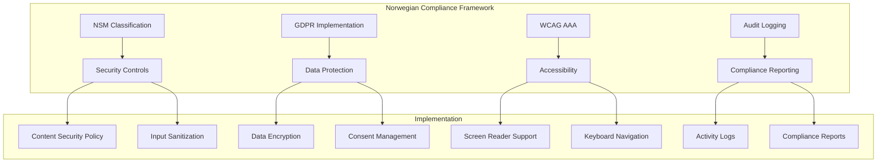

**NSM Classification Levels:**

```typescript
enum NSMClassification {
  OPEN = 'OPEN',           // Public information
  RESTRICTED = 'RESTRICTED', // Limited distribution
  CONFIDENTIAL = 'CONFIDENTIAL', // Sensitive information
  SECRET = 'SECRET'        // Highly sensitive
}

interface ComplianceConfig {
  nsm: {
    classification: NSMClassification;
    auditTrail: boolean;
    dataRetention: string; // ISO 8601 duration
    encryptionRequired: boolean;
  };
  gdpr: {
    enabled: boolean;
    consentManagement: boolean;
    dataPortability: boolean;
    rightToErasure: boolean;
  };
  wcag: {
    level: 'A' | 'AA' | 'AAA';
    screenReaderSupport: boolean;
    colorContrastRatio: number;
    keyboardNavigation: boolean;
  };
}
```

### Security Implementation

**Content Security Policy Generation:**

```typescript
function generateCSP(config: ComplianceConfig): string {
  const csp = [
    "default-src 'self'",
    "script-src 'self' 'unsafe-inline'",
    "style-src 'self' 'unsafe-inline'",
    "img-src 'self' data: https:",
    "font-src 'self' https://fonts.gstatic.com",
    "connect-src 'self' https://api.example.com"
  ];
  
  if (config.nsm.classification === NSMClassification.SECRET) {
    csp.push("frame-ancestors 'none'");
    csp.push("form-action 'self'");
  }
  
  return csp.join('; ');
}
```

**Input Sanitization:**

```typescript
import DOMPurify from 'dompurify';

function sanitizeInput(input: string, classification: NSMClassification): string {
  const baseConfig = {
    ALLOWED_TAGS: ['b', 'i', 'em', 'strong', 'p', 'br'],
    ALLOWED_ATTR: []
  };
  
  if (classification === NSMClassification.SECRET) {
    return DOMPurify.sanitize(input, {
      ...baseConfig,
      ALLOWED_TAGS: ['p', 'br'], // Minimal tags only
      FORBID_ATTR: ['style', 'class', 'id']
    });
  }
  
  return DOMPurify.sanitize(input, baseConfig);
}
```

### Accessibility Implementation

**WCAG AAA Component Example:**

```typescript
import React from 'react';
import { cva } from 'class-variance-authority';

// WCAG AAA compliant button with 7:1 contrast ratio
const buttonVariants = cva([
  'inline-flex',
  'items-center',
  'justify-center',
  'min-h-[44px]', // WCAG: Minimum 44px touch target
  'px-6',
  'rounded-lg',
  'font-medium',
  'transition-all',
  'duration-200',
  'focus-visible:outline-none',
  'focus-visible:ring-4', // Enhanced focus ring for AAA
  'focus-visible:ring-offset-2',
  'disabled:pointer-events-none',
  'disabled:opacity-50'
], {
  variants: {
    variant: {
      primary: [
        'bg-blue-800', // AAA contrast: 7.04:1
        'text-white',
        'hover:bg-blue-900',
        'focus-visible:ring-blue-400'
      ],
      secondary: [
        'bg-gray-800', // AAA contrast: 12.63:1
        'text-white',
        'hover:bg-gray-900',
        'focus-visible:ring-gray-400'
      ]
    }
  }
});

export interface AccessibleButtonProps 
  extends React.ButtonHTMLAttributes<HTMLButtonElement> {
  readonly variant?: 'primary' | 'secondary';
  readonly loading?: boolean;
  readonly loadingText?: string;
}

export const AccessibleButton = React.forwardRef<
  HTMLButtonElement, 
  AccessibleButtonProps
>(({ 
  variant = 'primary', 
  loading, 
  loadingText = 'Loading...', 
  children, 
  disabled,
  ...props 
}, ref) => {
  return (
    <button
      ref={ref}
      className={buttonVariants({ variant })}
      disabled={disabled || loading}
      aria-busy={loading}
      aria-describedby={loading ? 'loading-text' : undefined}
      {...props}
    >
      {loading && (
        <>
          <svg
            className="animate-spin -ml-1 mr-3 h-5 w-5"
            xmlns="http://www.w3.org/2000/svg"
            fill="none"
            viewBox="0 0 24 24"
            aria-hidden="true"
          >
            <circle
              className="opacity-25"
              cx="12"
              cy="12"
              r="10"
              stroke="currentColor"
              strokeWidth="4"
            />
            <path
              className="opacity-75"
              fill="currentColor"
              d="M4 12a8 8 0 018-8V0C5.373 0 0 5.373 0 12h4zm2 5.291A7.962 7.962 0 014 12H0c0 3.042 1.135 5.824 3 7.938l3-2.647z"
            />
          </svg>
          <span id="loading-text" className="sr-only">
            {loadingText}
          </span>
        </>
      )}
      {loading ? loadingText : children}
    </button>
  );
});

AccessibleButton.displayName = 'AccessibleButton';
```

---

## Advanced Usage

### Multi-Platform Component Generation

The CLI can generate components for multiple platforms simultaneously:

```typescript
interface MultiPlatformOptions {
  platforms: Array<'react' | 'vue' | 'angular' | 'svelte'>;
  outputDir: string;
  theme: string;
  compliance: string[];
}

async function generateMultiPlatform(
  componentName: string, 
  options: MultiPlatformOptions
): Promise<GenerationResult> {
  const results: PlatformResult[] = [];
  
  for (const platform of options.platforms) {
    const platformResult = await generateForPlatform(componentName, {
      platform,
      outputDir: path.join(options.outputDir, platform),
      theme: options.theme,
      compliance: options.compliance
    });
    
    results.push({
      platform,
      success: platformResult.success,
      files: platformResult.files,
      errors: platformResult.errors
    });
  }
  
  return {
    componentName,
    platforms: results,
    overallSuccess: results.every(r => r.success)
  };
}
```

**Usage:**

```bash
# Generate button component for multiple platforms
xala generate Button --platforms react,vue,angular --output ./components

# This creates:
# ./components/react/Button.tsx
# ./components/vue/Button.vue  
# ./components/angular/button.component.ts
```

### AI-Powered Code Generation

The CLI supports different LLM sizes with optimized prompts:

```typescript
interface LLMOptimization {
  modelSize: '7b' | '13b' | '70b+';
  promptTemplate: string;
  maxTokens: number;
  temperature: number;
  contextWindow: number;
}

const LLM_CONFIGS: Record<string, LLMOptimization> = {
  '7b': {
    modelSize: '7b',
    promptTemplate: 'simple',
    maxTokens: 256,
    temperature: 0.3,
    contextWindow: 2048
  },
  '13b': {
    modelSize: '13b', 
    promptTemplate: 'detailed',
    maxTokens: 512,
    temperature: 0.5,
    contextWindow: 4096
  },
  '70b+': {
    modelSize: '70b+',
    promptTemplate: 'comprehensive',
    maxTokens: 1024,
    temperature: 0.7,
    contextWindow: 8192
  }
};
```

**Prompt Optimization Example:**

```typescript
function optimizePromptForModel(
  originalPrompt: string, 
  modelSize: string
): string {
  const config = LLM_CONFIGS[modelSize];
  
  switch (config.promptTemplate) {
    case 'simple':
      return simplifyPrompt(originalPrompt);
    case 'detailed':
      return addContext(originalPrompt);
    case 'comprehensive':
      return addExamplesAndContext(originalPrompt);
    default:
      return originalPrompt;
  }
}

function simplifyPrompt(prompt: string): string {
  // For 7B models: short, direct prompts
  const complexWords = {
    'sophisticated': 'simple',
    'comprehensive': 'complete',
    'enterprise-grade': 'professional'
  };
  
  let simplified = prompt;
  Object.entries(complexWords).forEach(([complex, simple]) => {
    simplified = simplified.replace(new RegExp(complex, 'gi'), simple);
  });
  
  // Limit to 50 words max
  return simplified.split(' ').slice(0, 50).join(' ');
}
```

### Batch Operations

```bash
# Validate all components in a directory
xala check src/components/ --recursive --report

# Migrate multiple files with progress tracking
xala migrate convert src/components/*.tsx --batch --progress

# Generate multiple components from a list
xala generate --from-file component-list.txt --batch
```

**component-list.txt:**
```
UserProfile: User profile component with avatar and details
Dashboard: Admin dashboard with charts and metrics
ProductCatalog: E-commerce product listing with filters
ShoppingCart: Shopping cart with item management
CheckoutForm: Multi-step checkout process
```

---

## Troubleshooting

### Common Issues and Solutions

#### 1. Version Compatibility Issues

**Problem:** Xaheen and Xala UI versions are incompatible

```bash
❌ Xaheen 2.0.0 requires Xala UI version: 1.2.0 or 2.0.0
   Current Xala UI version: 1.0.0
```

**Solution:**
```bash
# Check compatibility matrix
xala xaheen init --check-compatibility

# Update to compatible versions
npm update -g @xaheen/cli @xala-technologies/xala-cli

# Or specify compatible versions
npm install -g @xala-technologies/xala-cli@1.2.0
```

#### 2. Migration Failures

**Problem:** Component migration fails with TypeScript errors

```bash
❌ Conversion failed: Cannot convert class component to functional component
```

**Solution:**
```bash
# Use interactive mode for complex conversions
xala migrate convert MyComponent.tsx --interactive

# Create backup before attempting conversion
xala migrate convert MyComponent.tsx --backup

# Use dry-run to see what would change
xala migrate convert MyComponent.tsx --dry-run
```

#### 3. Hook Execution Failures

**Problem:** Integration hooks are not running

```bash
⚠️ Pre-build hook failed to execute
```

**Solution:**
```bash
# Make hooks executable
chmod +x .xaheen/hooks/*.sh

# Test hook manually
./.xaheen/hooks/pre-build.sh

# Check hook configuration
cat xala.config.json | jq '.integrations.xaheen.hooks'

# Regenerate hooks
xala xaheen init --regenerate-hooks
```

#### 4. Dependency Issues

**Problem:** Missing or incompatible dependencies

```bash
❌ tailwindcss@2.2.19 does not satisfy requirement >=3.0.0
```

**Solution:**
```bash
# Run dependency check
xala install --check-deps --verbose

# Auto-fix dependency issues
xala install --auto-fix

# Manual installation
npm install tailwindcss@^3.0.0 --save-dev
```

#### 5. Configuration Validation Errors

**Problem:** Invalid configuration schema

```bash
❌ Configuration validation failed:
   - Project name is required
   - Unsupported platform: ember
```

**Solution:**
```bash
# Validate current configuration
xala config validate

# Fix configuration interactively
xala config fix --interactive

# Reset to default configuration
xala config reset --backup
```

### Debug Mode

Enable detailed logging for troubleshooting:

```bash
# Enable debug mode
export XALA_DEBUG=true
export XAHEEN_DEBUG=true

# Run commands with verbose output
xala xaheen init --verbose --debug

# Check log files
tail -f ~/.xala/logs/debug.log
tail -f ~/.xaheen/logs/integration.log
```

### Health Check Command

```bash
# Comprehensive system health check
xala doctor

# Output:
✅ Node.js version: v18.17.0 (compatible)
✅ npm version: v9.6.7 (compatible)  
✅ Xala CLI version: v1.0.0 (latest)
⚠️  Xaheen CLI: not installed
✅ Project configuration: valid
✅ Dependencies: all compatible
❌ Integration hooks: not executable

🔧 Recommended fixes:
1. Install Xaheen CLI: npm install -g @xaheen/cli
2. Fix hook permissions: chmod +x .xaheen/hooks/*.sh
```

---

## API Reference

### Command Line Interface

#### Core Commands

```bash
# Installation and setup
xala install [options]                 # Install UI system
xala migrate analyze [path] [options]  # Analyze for migration  
xala migrate convert <file> [options]  # Convert component
xala check <file> [options]           # Validate component

# Integration commands
xala xaheen init [options]            # Initialize Xaheen integration
xala xaheen sync [options]            # Sync with backend changes

# Generation commands  
xala ai generate <prompt> [options]   # AI-powered generation
xala generate <component> [options]   # Template-based generation

# Development commands
xala dev [options]                    # Start development server
xala build [options]                  # Build for production
```

#### Command Options

```bash
# Global options (available for all commands)
--verbose, -v          # Enable verbose output
--debug               # Enable debug mode  
--config <path>       # Specify config file path
--help, -h           # Show help
--version, -V        # Show version

# Install command options
--force, -f          # Force installation
--skip-deps          # Skip dependency installation
--platform <name>    # Target platform (react, vue, etc.)
--theme <name>       # UI theme (enterprise, healthcare, etc.)
--compliance <list>  # Compliance requirements (nsm, gdpr, etc.)
--backup            # Create backup before changes

# Migration command options
--dry-run           # Show changes without applying
--interactive, -i   # Interactive mode with prompts
--backup, -b        # Create backup before conversion
--format <type>     # Output format (json, html, markdown)
--report           # Generate detailed report

# Check command options
--score-only       # Show only compatibility score
--fix-suggestions  # Show specific fix commands
--json            # Output as JSON
```

### Programmatic API

#### XaheenBridge Class

```typescript
class XaheenBridge {
  constructor(projectPath?: string);
  
  // Project Detection
  async detectXaheenProject(): Promise<boolean>;
  async validateCompatibility(): Promise<void>;
  
  // Integration Setup
  async initializeXalaUI(options: XaheenIntegrationOptions): Promise<void>;
  async setupIntegrationHooks(): Promise<void>;
  async createUnifiedWorkflow(): Promise<void>;
  
  // Configuration Management
  async updateXaheenConfig(options: XaheenIntegrationOptions): Promise<void>;
}

interface XaheenIntegrationOptions {
  useXalaUI: boolean;
  theme?: string;
  industry?: string;
  compliance?: string[];
  components?: string[];
  skipUISetup?: boolean;
  interactive?: boolean;
}
```

#### XalaProgrammaticAPI Class

```typescript
class XalaProgrammaticAPI {
  // Component Generation
  static async generateComponents(
    components: string[],
    options: {
      platform: string;
      theme?: string;
      outputDir?: string;
    }
  ): Promise<{
    success: boolean;
    generatedFiles: string[];
    errors: string[];
  }>;
  
  // Component Validation
  static async validateComponents(
    filePaths: string[]
  ): Promise<{
    overallScore: number;
    componentScores: Array<{
      file: string;
      score: number;
      issues: string[];
    }>;
  }>;
  
  // Migration Application
  static async applyMigrations(
    filePaths: string[],
    options?: {
      dryRun?: boolean;
      backup?: boolean;
    }
  ): Promise<{
    success: boolean;
    migratedFiles: string[];
    errors: string[];
  }>;
}
```

#### SharedConfigManager Class

```typescript
class SharedConfigManager {
  constructor(projectPath?: string);
  
  // Configuration Management
  async loadConfig(): Promise<SharedProjectConfig>;
  async saveConfig(): Promise<void>;
  async updateConfig(updates: Partial<SharedProjectConfig>): Promise<void>;
  
  // Integration Management
  async enableXaheenIntegration(config: {
    version: string;
    features: string[];
    autoSync?: boolean;
  }): Promise<void>;
  
  isXaheenIntegrated(): boolean;
  
  // Export/Import
  async exportForTool(tool: 'xaheen' | 'storybook' | 'figma'): Promise<Record<string, any>>;
  async validateConfig(): Promise<{ valid: boolean; errors: string[] }>;
}
```

#### DependencyManager Class

```typescript
class DependencyManager {
  constructor(projectPath?: string);
  
  // Dependency Checking
  async checkDependencies(): Promise<{
    compatible: boolean;
    dependencies: DependencyInfo[];
    recommendations: string[];
  }>;
  
  // Installation Management
  async installMissingDependencies(
    dependencies: DependencyInfo[]
  ): Promise<{
    success: boolean;
    installed: string[];
    failed: string[];
  }>;
  
  // Compatibility Checking
  async checkXaheenCompatibility(
    xaheenVersion: string,
    xalaVersion: string
  ): Promise<{
    compatible: boolean;
    recommendations: string[];
  }>;
  
  // Reporting
  async generateDependencyReport(): Promise<string>;
  async autoFixDependencies(): Promise<{
    success: boolean;
    fixes: string[];
    errors: string[];
  }>;
}
```

### Type Definitions

```typescript
// Configuration Types
interface SharedProjectConfig {
  name: string;
  version: string;
  type: 'standalone' | 'xaheen-integrated' | 'custom';
  ui: UIConfig;
  integrations: IntegrationConfig;
  development: DevelopmentConfig;
  build: BuildConfig;
  compliance: ComplianceConfig;
}

interface UIConfig {
  system: 'xala';
  version: string;
  theme: string;
  platform: 'react' | 'nextjs' | 'vue' | 'nuxt' | 'angular';
  compliance: string[];
  customizations: Record<string, any>;
}

// Migration Types
interface MigrationAnalysis {
  file: string;
  overallScore: number;
  complexity: 'simple' | 'moderate' | 'complex';
  issues: MigrationIssue[];
  recommendations: MigrationRecommendation[];
  estimatedTime: string;
}

interface MigrationIssue {
  category: 'architecture' | 'styling' | 'typescript' | 'accessibility' | 'performance';
  severity: 'error' | 'warning' | 'info';
  message: string;
  line?: number;
  column?: number;
  suggestion?: string;
}

// Validation Types
interface ComponentCheck {
  file: string;
  score: number;
  status: 'excellent' | 'good' | 'needs-work' | 'requires-migration';
  checks: CheckResult[];
  quickFixes: QuickFix[];
  estimatedTime: string;
}

interface CheckResult {
  name: string;
  passed: boolean;
  severity: 'error' | 'warning' | 'info';
  message: string;
  suggestion?: string;
  documentation?: string;
}
```

---

This comprehensive documentation covers all the latest functionalities added to the Xala UI CLI, with particular emphasis on the Xaheen integration system. The documentation includes detailed architecture diagrams, code examples, configuration schemas, and practical usage scenarios for enterprise development teams.