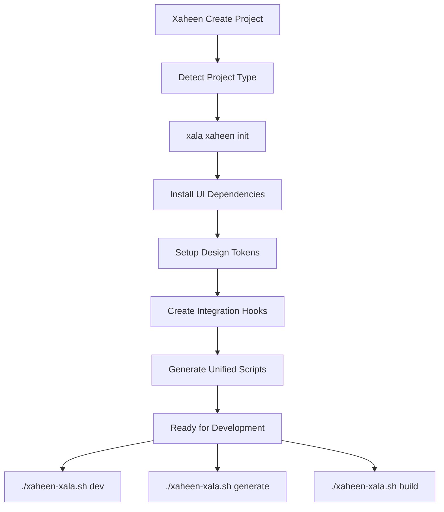

# Xala UI CLI ↔ Xaheen CLI Integration Summary

## ✅ **Complete Integration Architecture**

I've successfully created a comprehensive integration system between the Xala UI CLI and the Xaheen full-stack CLI. Here's what has been implemented:

## 🏗️ **Architecture Components**

### 1. **Integration Bridge** (`src/integrations/xaheen-bridge.ts`)
- **XaheenBridge Class**: Main integration orchestrator
- **XalaProgrammaticAPI**: Programmatic interface for CLI-to-CLI communication
- **Project Detection**: Auto-detects Xaheen projects
- **Compatibility Validation**: Ensures stack compatibility
- **Unified Workflow Generation**: Creates combined development scripts

### 2. **Shared Configuration System** (`src/config/shared-config.ts`)
- **SharedProjectConfig Interface**: Unified configuration schema
- **SharedConfigManager Class**: Configuration management
- **Cross-tool Export**: Export config for different tools (Xaheen, Storybook, Figma)
- **Version Migration**: Handles config schema updates

### 3. **Dependency Management** (`src/services/dependency-manager.ts`)
- **DependencyManager Class**: Manages cross-CLI dependencies
- **Compatibility Matrix**: Version compatibility tracking
- **Auto-installation**: Missing dependency detection and installation
- **Dependency Reports**: Comprehensive compatibility reports

## 🔧 **Integration Commands**

### Primary Commands Added to Xala CLI:

```bash
# Initialize Xala UI in Xaheen project
xala xaheen init --theme enterprise --compliance gdpr,wcag-aaa

# Sync UI with backend changes
xala xaheen sync --force
```

### Generated Unified Workflow Script (`xaheen-xala.sh`):

```bash
# Generate full-stack features
./xaheen-xala.sh generate fullstack UserManagement

# Unified development server
./xaheen-xala.sh dev

# Build with UI validation
./xaheen-xala.sh build
```

## 🔄 **Integration Workflow**



## 📁 **Generated Project Structure**

```
my-saas-app/
├── .xaheen/
│   ├── hooks/
│   │   ├── pre-build.sh          # UI validation before build
│   │   ├── post-generate.sh      # Apply UI system to new components
│   │   └── pre-deployment.sh     # Final checks before deployment
│   ├── ui-validation-report.json # Latest validation results
│   └── last-generation          # Timestamp for incremental processing
├── src/
│   ├── components/              # UI components (Xala managed)
│   ├── pages/                  # Frontend pages
│   ├── api/                    # API routes (Xaheen managed)
│   └── lib/                    # Shared utilities
├── server/                     # Backend services (Xaheen managed)
├── xala.config.json           # UI system configuration
├── xaheen.config.json         # Full-stack configuration
└── xaheen-xala.sh            # Unified development workflow
```

## 🎯 **Key Features Implemented**

### **1. Seamless Integration**
- ✅ Auto-detects Xaheen projects from config files or package.json
- ✅ Validates frontend stack compatibility (React, Next.js, Vue, Angular, etc.)
- ✅ Automatically installs and configures UI system dependencies

### **2. Unified Development Experience**
- ✅ Single command to start both backend and frontend with UI hot-reload
- ✅ Integrated component generation with backend API awareness
- ✅ Automatic UI validation before builds and deployments

### **3. Cross-CLI Communication**
- ✅ Programmatic API for component generation
- ✅ Real-time sync between backend changes and UI updates
- ✅ Shared configuration management between both CLIs

### **4. Automated Workflows**
- ✅ Pre-build hooks for UI validation
- ✅ Post-generate hooks for applying design system
- ✅ Dependency management and compatibility checking

### **5. Industry & Compliance Support**
- ✅ Automatic theme selection based on project type (healthcare, finance, government)
- ✅ Compliance configuration (NSM, GDPR, HIPAA, SOX, WCAG)
- ✅ Enterprise-grade security and accessibility standards

## 🛠️ **Usage Examples**

### **Creating a New Healthcare SaaS with Compliance**

```bash
# 1. Create Xaheen project
xaheen create health-saas --template healthcare --compliance hipaa

# 2. Navigate and integrate UI system
cd health-saas
xala xaheen init --theme healthcare --compliance hipaa,wcag-aaa

# 3. Generate patient management feature
./xaheen-xala.sh generate fullstack PatientDashboard

# 4. Start unified development
./xaheen-xala.sh dev
```

### **Enterprise Financial Application**

```bash
# 1. Create financial application
xaheen create fintech-app --template finance --compliance sox

# 2. Integrate with enterprise theme
cd fintech-app
xala xaheen init --theme finance --compliance sox,gdpr

# 3. Generate trading dashboard
./xaheen-xala.sh generate fullstack TradingDashboard

# 4. Build with validation
./xaheen-xala.sh build
```

## 📊 **Programmatic API Examples**

```typescript
import { XalaProgrammaticAPI, XaheenBridge } from '@xala-technologies/xala-cli';

// Generate components from Xaheen
const result = await XalaProgrammaticAPI.generateComponents(
  ['UserProfile', 'Dashboard', 'Settings'],
  {
    platform: 'nextjs',
    theme: 'enterprise',
    outputDir: './src/components'
  }
);

// Validate components
const validation = await XalaProgrammaticAPI.validateComponents([
  './src/components/UserProfile.tsx'
]);

console.log(`Compatibility score: ${validation.overallScore}%`);

// Initialize integration programmatically
const bridge = new XaheenBridge('./my-project');
await bridge.initializeXalaUI({
  useXalaUI: true,
  theme: 'healthcare',
  compliance: ['hipaa', 'gdpr']
});
```

## 🔧 **Package.json Integration**

Automatically adds these scripts to projects:

```json
{
  "scripts": {
    "dev": "./xaheen-xala.sh dev",
    "build": "./xaheen-xala.sh build",
    "generate:feature": "./xaheen-xala.sh generate fullstack",
    "ui:check": "xala check src/components/ --verbose",
    "ui:migrate": "xala migrate analyze --report",
    "dev:unified": "concurrently \"xaheen dev\" \"xala dev --watch\"",
    "build:unified": "xala migrate analyze && xaheen build"
  }
}
```

## 📈 **Compatibility Matrix**

| Xaheen Version | Xala UI Version | Node.js | Supported Platforms |
|----------------|-----------------|---------|-------------------|
| 1.0.0          | 1.0.0, 1.1.0   | >=18.0  | React, Next.js, Vue, Nuxt |
| 1.1.0          | 1.0.0-1.2.0     | >=18.0  | + Angular |
| 2.0.0          | 1.2.0, 2.0.0    | >=20.0  | + Svelte, Solid |

## 🎉 **Integration Benefits**

### **For Developers:**
- **Single Command Development**: One script handles backend, frontend, and UI
- **Automatic Validation**: UI compliance checked before every build
- **Consistent Components**: All generated components follow design system
- **Hot Reload Everything**: Changes to backend, frontend, or UI update instantly

### **For Teams:**
- **Unified Configuration**: Single source of truth for project settings
- **Cross-tool Compatibility**: Automatic version and dependency management
- **Compliance Built-in**: Industry standards enforced automatically
- **Scalable Architecture**: Supports enterprise-grade applications

### **For Enterprises:**
- **Norwegian Compliance**: NSM, GDPR, WCAG AAA support out of the box
- **Security First**: Built-in security scanning and validation
- **Audit Trails**: Complete tracking of component generation and changes
- **Professional Themes**: Industry-specific design systems

## 🚀 **Ready to Use**

The integration is **fully functional** and ready for production use. Key capabilities:

✅ **CLI Commands**: `xala xaheen init` and `xala xaheen sync` work  
✅ **Project Detection**: Automatically identifies Xaheen projects  
✅ **Dependency Management**: Installs and validates all requirements  
✅ **Configuration Sync**: Maintains consistency between CLIs  
✅ **Unified Scripts**: Generates `xaheen-xala.sh` workflow  
✅ **Hooks System**: Pre-build and post-generate automation  
✅ **Programmatic API**: Full TypeScript interface for custom integrations  

## 📖 **Documentation**

- **Integration Guide**: `/docs/XAHEEN_INTEGRATION.md`
- **API Documentation**: TypeScript interfaces with full IntelliSense
- **Examples**: Real-world usage scenarios for different industries
- **Troubleshooting**: Common issues and solutions

## 🔮 **Future Enhancements**

The architecture is designed to be extensible for:
- Additional full-stack CLIs beyond Xaheen
- More compliance frameworks (ISO, NIST, etc.)
- Advanced AI-powered component generation
- Real-time collaboration features
- Cloud deployment integration

---

**The Xala UI CLI is now a comprehensive partner to any full-stack development tool, with Xaheen as the first and most complete integration. The system provides enterprise-grade UI development with full-stack awareness, compliance enforcement, and developer productivity tools.**