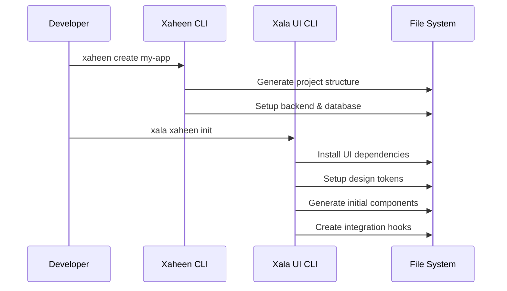
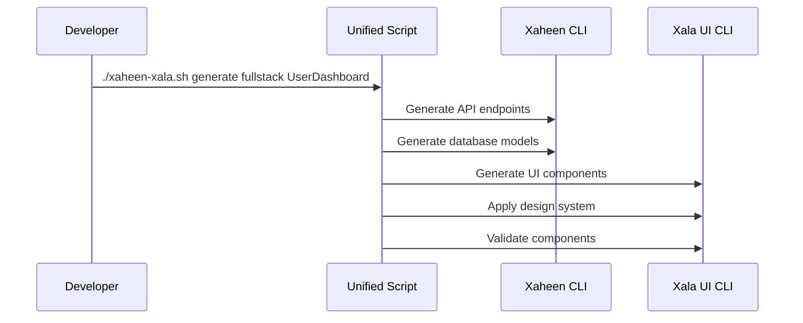

# Xaheen CLI Integration Guide

This guide explains how to integrate the Xala UI CLI with Xaheen full-stack CLI for comprehensive application development across multiple platforms.

## Overview

The integration enables Xaheen to automatically use the Xala UI system for frontend generation across **6 platforms** (React, Next.js, Vue, Angular, Svelte, Electron) with enterprise-grade semantic architecture, creating a unified development experience for full-stack applications with v5.0 CVA compliance and mandatory localization.

## Architecture

```
┌─────────────────┐    ┌─────────────────┐    ┌─────────────────┐
│   Xaheen CLI    │◄──►│  Integration    │◄──►│   Xala UI CLI   │
│                 │    │     Bridge      │    │                 │
│ • Backend Gen   │    │                 │    │ • Multi-Platform│
│ • Database      │    │ • Config Sync   │    │   React/Next.js │
│ • API Routes    │    │ • Dependency    │    │   Vue/Angular   │
│ • Auth          │    │   Management    │    │   Svelte/Electron│
│ • Deployment    │    │ • Platform      │    │ • Semantic Arch │
│                 │    │   Detection     │    │ • v5.0 CVA      │
│                 │    │ • Hooks         │    │ • i18n/a11y     │
└─────────────────┘    └─────────────────┘    └─────────────────┘
```

### Supported Platforms

| Platform | Template Engine | Components | Localization | Architecture |
|----------|----------------|------------|--------------|--------------|
| **React** | TSX Templates | `<Container>`, `<Section>` | `t()` function | v5.0 CVA |
| **Next.js** | App/Pages Router | `<AppShell>`, `<Grid>` | `t()` function | v5.0 CVA |
| **Vue 3** | SFC Templates | `<AppShell>`, `<Card>` | `{{ t() }}` | Composition API |
| **Angular** | Component Templates | CSS Classes | `\| translate` | Standalone Components |
| **Svelte** | Svelte Components | `<Section>`, `<Button>` | `{t()}` | SvelteKit Ready |
| **Electron** | Renderer Process | `<WindowControls>` | `{t()}` | Desktop Native |

## Quick Start

### 1. Install Both CLIs

```bash
# Install Xaheen CLI (assuming it exists)
npm install -g @xaheen/cli

# Install Xala UI CLI
npm install -g @xala-technologies/xala-cli
```

### 2. Create New Full-Stack Project with UI System

```bash
# Create project with Xaheen
xaheen create my-saas-app --template enterprise

# Navigate to project
cd my-saas-app

# Integrate Xala UI system with platform selection
xala xaheen init --platform nextjs --theme enterprise --compliance gdpr,wcag-aaa

# Alternative: Interactive platform selection
xala xaheen init --interactive
```

**Platform Selection:**
```bash
? Select your frontend platform:
❯ Next.js (App Router + Pages Router)
  React (CRA + Vite)
  Vue 3 (Composition API)
  Angular (Standalone Components)
  Svelte (SvelteKit)
  Electron (Desktop Apps)
```

### 3. Use Unified Development Workflow

```bash
# Start unified development
./xaheen-xala.sh dev

# Generate full-stack features
./xaheen-xala.sh generate fullstack UserManagement

# Build with UI validation
./xaheen-xala.sh build
```

## Integration Commands

### `xala xaheen init`

Initialize Xala UI system in an existing Xaheen project with multi-platform support.

```bash
xala xaheen init [options]

Options:
  -p, --platform <platform>    Frontend platform (react, nextjs, vue, angular, svelte, electron)
  -t, --theme <theme>           UI theme (enterprise, healthcare, finance)
  -i, --industry <industry>     Industry preset
  -c, --compliance <list>       Compliance requirements (nsm,gdpr,hipaa,sox,wcag-aaa)
  --components <list>           Initial components to generate
  --features <list>             Platform features (navbar, dashboard, auth)
  --locale <locale>             Default locale (en, nb-NO, fr, ar)
  --skip-ui-setup              Skip initial UI setup
  --skip-localization          Skip i18n setup
  --interactive                 Interactive setup mode
```

**Examples:**

```bash
# Basic Next.js integration
xala xaheen init --platform nextjs

# Vue healthcare application with compliance
xala xaheen init --platform vue --theme healthcare --compliance hipaa,gdpr,wcag-aaa

# Angular financial application with Norwegian locale
xala xaheen init --platform angular --theme finance --compliance sox --locale nb-NO

# Electron desktop app with features
xala xaheen init --platform electron --features "navbar,dashboard" --theme enterprise

# Interactive multi-platform setup
xala xaheen init --interactive
```

**Platform-Specific Features:**

| Platform | Available Features | Default Locale Support | Architecture |
|----------|-------------------|------------------------|--------------|
| **Next.js** | App Router, Pages Router, API Routes | 4 languages | v5.0 CVA |
| **React** | CRA, Vite, Router, State Management | 4 languages | v5.0 CVA |
| **Vue 3** | Composition API, Pinia, Vue Router | 4 languages | Script Setup |
| **Angular** | Standalone Components, Signal Store | 4 languages | Angular 17+ |
| **Svelte** | SvelteKit, Stores, Routing | 4 languages | Svelte 4+ |
| **Electron** | Main/Renderer Process, Native APIs | 4 languages | Cross-platform |

### `xala xaheen sync`

Sync UI components with backend API changes.

```bash
xala xaheen sync [options]

Options:
  -f, --force    Force sync even with conflicts
  --components   Sync specific components only
  --platform     Target platform for sync
```

### `xala xaheen generate`

Generate comprehensive component library for any platform.

```bash
xala xaheen generate [component] [options]

Options:
  -p, --platform <platform>    Target platform (react, nextjs, vue, angular, svelte, electron, react-native)
  -c, --category <category>     Component category (components, layouts, providers, patterns, tools)
  --semantic                   Use v5.0 semantic architecture
  --with-stories               Generate Storybook stories
  --with-tests                 Generate test files
  --enterprise                 Use enterprise compliance patterns
```

**Available Components:**

| Category | Components | All Platforms | Description |
|----------|------------|---------------|-------------|
| **UI Components** | navbar, modal, sidebar, header, form, card, dashboard | ✅ | Core interface components |
| **Data Components** | data-table, virtual-list, command-palette, global-search | ✅ | Data presentation and interaction |
| **Theme Components** | theme-switcher, theme-selector | ✅ | Theming and customization |
| **Layout Components** | app-shell, layout | ✅ | Application structure |
| **Provider Components** | auth-provider, theme-provider, error-boundary, notification-provider | ✅ | Context and state management |
| **Advanced Patterns** | render-props, hoc-collection, component-factory | React/Next.js | Advanced composition patterns |
| **Enterprise Tools** | performance-monitor, code-generator | ✅ | Development and monitoring tools |

**Examples:**

```bash
# Generate navbar for all platforms
xala xaheen generate navbar --all-platforms --semantic

# Generate complete dashboard for Next.js
xala xaheen generate dashboard --platform nextjs --with-stories --enterprise

# Generate data-table with tests for Vue
xala xaheen generate data-table --platform vue --with-tests --semantic

# Generate complete component library for Angular
xala xaheen generate all --platform angular --enterprise --semantic
```

## Configuration

### Unified Configuration (`xala.config.json`)

```json
{
  "name": "my-saas-app",
  "version": "1.0.0",
  "type": "xaheen-integrated",
  "ui": {
    "system": "xala",
    "version": "5.0.0",
    "architecture": "semantic-v5",
    "theme": "enterprise",
    "platform": "nextjs",
    "compliance": ["gdpr", "wcag-aaa", "nsm"],
    "localization": {
      "defaultLocale": "en",
      "supportedLocales": ["en", "nb-NO", "fr", "ar"]
    },
    "features": {
      "navbar": true,
      "dashboard": true,
      "semanticComponents": true,
      "designTokens": true
    },
    "componentLibrary": {
      "components": ["navbar", "modal", "sidebar", "header", "form", "card", "dashboard"],
      "dataComponents": ["data-table", "virtual-list", "command-palette", "global-search"],
      "themeComponents": ["theme-switcher", "theme-selector"],
      "layouts": ["app-shell", "layout"],
      "providers": ["auth-provider", "theme-provider", "error-boundary", "notification-provider"],
      "patterns": ["render-props", "hoc-collection", "component-factory"],
      "tools": ["performance-monitor", "code-generator"]
    }
  },
  "integrations": {
    "xaheen": {
      "enabled": true,
      "version": "1.0.0",
      "features": ["auth", "dashboard", "api"],
      "autoSync": true,
      "platformSync": {
        "nextjs": {
          "appRouter": true,
          "pagesRouter": true,
          "apiRoutes": true
        }
      },
      "hooks": {
        "preBuild": ".xaheen/hooks/pre-build.sh",
        "postGenerate": ".xaheen/hooks/post-generate.sh",
        "preLocalize": ".xaheen/hooks/pre-localize.sh"
      }
    }
  }
}
```

### Platform-Specific Configurations

**Next.js Configuration:**
```json
{
  "platform": "nextjs",
  "features": {
    "appRouter": true,
    "pagesRouter": true,
    "apiRoutes": true,
    "middleware": true
  },
  "templates": {
    "page": "app-router/page.tsx.hbs",
    "layout": "app-router/layout.tsx.hbs",
    "component": "component-basic.hbs"
  }
}
```

**Vue 3 Configuration:**
```json
{
  "platform": "vue",
  "features": {
    "compositionApi": true,
    "scriptSetup": true,
    "pinia": true,
    "vueRouter": true
  },
  "templates": {
    "component": "components/App.vue.hbs",
    "composable": "composables/useTheme.ts.hbs"
  }
}
```

**Angular Configuration:**
```json
{
  "platform": "angular",
  "features": {
    "standaloneComponents": true,
    "signals": true,
    "ngTranslate": true
  },
  "templates": {
    "component": "components/app.component.ts.hbs",
    "service": "services/theme.service.ts.hbs"
  }
}
```

### Xaheen Configuration Updates

When integrated, Xaheen's config is automatically updated:

```json
{
  "name": "my-saas-app",
  "type": "saas",
  "stack": {
    "frontend": "nextjs",
    "backend": "nestjs",
    "database": "postgresql"
  },
  "ui": {
    "system": "xala",
    "theme": "enterprise",
    "autoGenerate": true,
    "hooks": {
      "preBuild": ".xaheen/hooks/pre-build.sh",
      "postGenerate": ".xaheen/hooks/post-generate.sh"
    }
  }
}
```

## v5.0 Semantic Architecture

### Enterprise Architecture Compliance

All generated components follow **v5.0 semantic architecture** standards:

#### ✅ **Semantic Components Only**
```typescript
// ❌ Before: Raw HTML elements
<div className="container">
  <h1 className="text-4xl">Welcome</h1>
  <p className="text-lg">Description</p>
</div>

// ✅ After: Semantic components
<Container spacing="lg">
  <Heading level={1} variant="hero">
    {t('welcome.title')}
  </Heading>
  <Text variant="lead">
    {t('welcome.description')}
  </Text>
</Container>
```

#### ✅ **Mandatory Localization**
All text must use translation functions across all platforms:

| Platform | Localization Pattern | Example |
|----------|---------------------|---------|
| **React/Next.js** | `t()` function | `{t('welcome.title', { name })}` |
| **Vue 3** | Template syntax | `{{ t('welcome.title', { name }) }}` |
| **Angular** | Pipe syntax | `{{ 'welcome.title' \| translate: { name } }}` |
| **Svelte** | Function call | `{t('welcome.title', { name })}` |
| **Electron** | Direct call | `{t('welcome.title', { name })}` |

#### ✅ **Design Token Usage**
```typescript
// ❌ Before: Hardcoded styling
className="py-8 px-4 text-4xl font-bold w-full"

// ✅ After: Semantic props
spacing="lg" 
variant="hero" 
fullWidth
```

#### ✅ **Zero Raw HTML Policy**
- **❌ NO** `div`, `span`, `p`, `h1-h6`, `button`, `input` elements in pages
- **✅ ONLY** semantic components from `@xala-technologies/ui-system`
- **✅ MANDATORY** design token usage for all styling
- **✅ WCAG 2.2 AAA** compliance for accessibility

### Platform-Specific Semantic Architecture

**React/Next.js:**
```typescript
import { Container, Section, Heading, Text, Button } from '@xala-technologies/ui-system';
import { t } from '@xala-technologies/ui-system/i18n';

export default function Page(): JSX.Element {
  return (
    <Container spacing="lg">
      <Section align="center" spacing="md">
        <Heading level={1} variant="hero">
          {t('welcome.title')}
        </Heading>
      </Section>
    </Container>
  );
}
```

**Vue 3:**
```vue
<template>
  <AppShell :theme="theme" fullHeight>
    <Section align="center" spacing="md">
      <Heading :level="1" variant="hero">
        {{ t('welcome.title') }}
      </Heading>
    </Section>
  </AppShell>
</template>

<script setup lang="ts">
import { AppShell, Section, Heading } from '@xala-technologies/ui-system';
import { t } from '@xala-technologies/ui-system/i18n';
</script>
```

**Angular:**
```typescript
@Component({
  template: `
    <div class="app-shell" [attr.data-theme]="theme">
      <div class="section section-center spacing-md">
        <h1 class="heading heading-hero">
          {{ 'welcome.title' | translate }}
        </h1>
      </div>
    </div>
  `
})
export class AppComponent {
  constructor(private translate: TranslateService) {}
}
```

## Workflow Integration

### 1. Project Generation



### 2. Feature Development



### 3. Development Server

```bash
# Unified development command
./xaheen-xala.sh dev

# This runs concurrently:
# - xaheen dev:backend (NestJS server)
# - xaheen dev:frontend (Next.js)
# - xala dev --watch (UI system hot reload)
```

## Programmatic API

For custom integrations, use the programmatic API:

```typescript
import { XalaProgrammaticAPI, XaheenBridge } from '@xala-technologies/xala-cli/integrations';

// Generate components programmatically
const result = await XalaProgrammaticAPI.generateComponents(
  ['UserProfile', 'Dashboard', 'Settings'],
  {
    platform: 'nextjs',
    theme: 'enterprise',
    outputDir: './src/components'
  }
);

// Validate components
const validation = await XalaProgrammaticAPI.validateComponents([
  './src/components/UserProfile.tsx',
  './src/components/Dashboard.tsx'
]);

console.log(`Overall score: ${validation.overallScore}%`);

// Initialize integration
const bridge = new XaheenBridge('./my-project');
await bridge.initializeXalaUI({
  useXalaUI: true,
  theme: 'healthcare',
  compliance: ['hipaa', 'gdpr']
});
```

## Hooks and Automation

### Pre-Build Hook (`.xaheen/hooks/pre-build.sh`)

```bash
#!/bin/bash
# Validate UI components before build
echo "🎨 Validating UI components..."

xala migrate analyze --report --format json > .xaheen/ui-validation-report.json

if [ $? -ne 0 ]; then
  echo "❌ UI validation failed. Run 'xala check' to fix issues."
  exit 1
fi

echo "✅ UI components validated successfully"
```

### Post-Generate Hook (`.xaheen/hooks/post-generate.sh`)

```bash
#!/bin/bash
# Auto-apply UI system to new components
echo "🎨 Applying UI system to generated components..."

# Find and fix new components
find src/components -name "*.tsx" -newer .xaheen/last-generation \
  -exec xala check {} --fix-suggestions \;

touch .xaheen/last-generation
echo "✅ UI system applied to new components"
```

## Package.json Integration

Automatically added scripts with multi-platform support:

```json
{
  "scripts": {
    "dev": "./xaheen-xala.sh dev",
    "build": "./xaheen-xala.sh build",
    "generate:feature": "./xaheen-xala.sh generate fullstack",
    "ui:check": "xala check src/components/ --verbose --platform-validate",
    "ui:migrate": "xala migrate analyze --report --semantic-check",
    "ui:dev": "xala dev --watch --platform nextjs",
    "ui:validate": "xala validate --semantic --localization --accessibility",
    "dev:unified": "concurrently \"xaheen dev\" \"xala dev --watch\"",
    "build:unified": "xala validate --semantic && xala migrate analyze && xaheen build",
    "localization:extract": "xala i18n extract --all-platforms",
    "localization:validate": "xala i18n validate --locales en,nb-NO,fr,ar",
    "semantic:validate": "xala semantic validate --zero-raw-html --design-tokens",
    "compliance:check": "xala compliance check --wcag-aaa --gdpr --nsm"
  }
}
```

### Platform-Specific Scripts

**Next.js Project:**
```json
{
  "scripts": {
    "dev:nextjs": "xala dev --platform nextjs --app-router --pages-router",
    "build:nextjs": "xala validate --platform nextjs && next build",
    "generate:page": "xala generate page --platform nextjs --semantic"
  }
}
```

**Vue 3 Project:**
```json
{
  "scripts": {
    "dev:vue": "xala dev --platform vue --composition-api",
    "build:vue": "xala validate --platform vue && vue-tsc && vite build",
    "generate:component": "xala generate component --platform vue --script-setup"
  }
}
```

**Angular Project:**
```json
{
  "scripts": {
    "dev:angular": "xala dev --platform angular --standalone",
    "build:angular": "xala validate --platform angular && ng build",
    "generate:component": "xala generate component --platform angular --standalone"
  }
}
```

## Dependency Management

The integration automatically handles:

### Required Dependencies

- **Node.js**: >=18.0.0
- **npm**: >=8.0.0
- **Platform dependencies**: React, Next.js, Vue, etc.
- **UI dependencies**: Tailwind CSS, CVA, clsx

### Automatic Installation

```bash
# Check dependencies
xala xaheen init --check-deps

# Auto-install missing dependencies
xala install --auto-deps
```

### Compatibility Matrix

| Xaheen Version | Xala UI Version | Node.js | Platforms | Architecture | Localization |
|----------------|-----------------|---------|-----------|--------------|--------------|
| 1.0.0 | 5.0.0+ | >=18.0 | React, Next.js | v5.0 CVA Semantic | 4 Languages |
| 1.1.0 | 5.0.0+ | >=18.0 | + Vue 3, Angular | v5.0 CVA Semantic | 4 Languages |
| 1.2.0 | 5.0.0+ | >=20.0 | + Svelte, Electron | v5.0 CVA Semantic | 4 Languages |

### Platform Support Matrix

| Platform | Min Version | Architecture | Semantic Components | Localization | Status |
|----------|-------------|--------------|-------------------|--------------|--------|
| **React** | 18.0+ | v5.0 CVA | ✅ Full Support | ✅ t() function | Stable |
| **Next.js** | 13.0+ | v5.0 CVA | ✅ Full Support | ✅ t() function | Stable |
| **Vue 3** | 3.3+ | Composition API | ✅ Full Support | ✅ Template i18n | Stable |
| **Angular** | 17.0+ | Standalone | ✅ CSS Classes | ✅ Pipe i18n | Stable |
| **Svelte** | 4.0+ | SvelteKit | ✅ Full Support | ✅ Function i18n | Stable |
| **Electron** | 25.0+ | Cross-platform | ✅ Full Support | ✅ Function i18n | Stable |

## Best Practices

### 1. Project Structure

```
my-saas-app/
├── .xaheen/
│   ├── hooks/
│   │   ├── pre-build.sh
│   │   └── post-generate.sh
│   └── ui-validation-report.json
├── src/
│   ├── components/          # UI components (Xala managed)
│   ├── pages/              # Next.js pages
│   ├── api/                # API routes (Xaheen managed)
│   └── lib/                # Utilities
├── server/                 # Backend (Xaheen managed)
├── xala.config.json        # UI system config
├── xaheen.config.json      # Full-stack config
└── xaheen-xala.sh         # Unified workflow script
```

### 2. Development Workflow

1. **Start with Xaheen**: Create project structure and backend
2. **Integrate Xala UI**: Add design system and components
3. **Use unified commands**: Leverage the combined workflow
4. **Validate regularly**: Check UI compliance before builds
5. **Sync on API changes**: Update UI when backend changes

### 3. Component Generation

```bash
# Generate backend + frontend together
./xaheen-xala.sh generate fullstack ProductCatalog

# This creates:
# - API endpoints (/api/products)
# - Database models (Product)
# - UI components (ProductList.tsx, ProductCard.tsx)
# - Forms (ProductForm.tsx)
# - Pages (products/index.tsx)
```

### 4. Theme Consistency

```bash
# Apply theme across all generated components
xala themes apply healthcare --update-existing

# Validate theme compliance
xala check src/ --theme-compliance
```

## Troubleshooting

### Common Issues

**1. Version Mismatch**
```bash
# Check compatibility
xala xaheen init --check-compatibility

# Update to compatible versions
npm update -g @xaheen/cli @xala-technologies/xala-cli
```

**2. Missing Dependencies**
```bash
# Diagnose dependency issues
xala install --check-deps --verbose

# Auto-fix common issues
xala install --auto-fix
```

**3. Integration Hooks Not Running**
```bash
# Make hooks executable
chmod +x .xaheen/hooks/*.sh

# Test hooks manually
./.xaheen/hooks/pre-build.sh
```

**4. Component Validation Failures**
```bash
# Get detailed validation report
xala migrate analyze --detailed --output validation-report.html

# Fix common issues automatically
xala migrate convert src/components/ --auto-fix
```

### Debug Mode

Enable detailed logging:

```bash
export XALA_DEBUG=true
export XAHEEN_DEBUG=true

./xaheen-xala.sh dev --verbose
```

## Migration Guide

### From Standalone to Integrated

If you have an existing Xaheen project:

```bash
# 1. Navigate to Xaheen project
cd my-existing-xaheen-project

# 2. Initialize Xala UI integration
xala xaheen init --interactive

# 3. Migrate existing components
xala migrate analyze src/components/
xala migrate convert src/components/ --backup

# 4. Update development workflow
npm run dev:unified
```

### From Xala UI Standalone

If you have a Xala UI project and want to add Xaheen:

```bash
# 1. Install Xaheen in existing project
npm install -g @xaheen/cli
xaheen init --existing --ui xala

# 2. Update configuration
xala config update --integration xaheen

# 3. Generate backend structure
xaheen generate:backend --match-frontend
```

## Examples

### Complete SaaS Application (Next.js)

```bash
# 1. Create enterprise SaaS project
xaheen create my-saas --template enterprise --features auth,billing,analytics

# 2. Integrate Xala UI with Next.js and compliance
cd my-saas
xala xaheen init --platform nextjs --theme enterprise --compliance gdpr,sox,wcag-aaa

# 3. Generate user management feature with semantic architecture
./xaheen-xala.sh generate fullstack UserManagement --semantic --localized

# 4. Generate billing dashboard with v5.0 architecture
./xaheen-xala.sh generate fullstack BillingDashboard --semantic --design-tokens

# 5. Validate semantic compliance and build
xala validate --semantic --localization --accessibility
./xaheen-xala.sh build
```

### Vue 3 Enterprise Application

```bash
# 1. Create Vue 3 project with Xaheen backend
xaheen create vue-enterprise --template enterprise --frontend vue

# 2. Integrate with Vue 3 Composition API
cd vue-enterprise
xala xaheen init --platform vue --theme enterprise --features navbar,dashboard

# 3. Generate components with semantic architecture
./xaheen-xala.sh generate fullstack ProductCatalog --platform vue --semantic

# 4. Validate Vue-specific patterns
xala validate --platform vue --semantic --composition-api
```

### Angular Standalone Components

```bash
# 1. Create Angular enterprise project
xaheen create angular-app --template enterprise --frontend angular

# 2. Initialize with Angular standalone components
cd angular-app
xala xaheen init --platform angular --theme enterprise --features standalone

# 3. Generate with Angular-specific patterns
./xaheen-xala.sh generate fullstack CustomerDashboard --platform angular --standalone

# 4. Validate Angular compliance
xala validate --platform angular --standalone --ng-translate
```

### Electron Desktop Application

```bash
# 1. Create Electron project with backend
xaheen create desktop-app --template desktop --features auth,sync

# 2. Initialize Electron with native features
cd desktop-app
xala xaheen init --platform electron --theme enterprise --features window-controls

# 3. Generate desktop-specific components
./xaheen-xala.sh generate fullstack MainWindow --platform electron --native

# 4. Build for multiple platforms
xala validate --platform electron --native-apis
./xaheen-xala.sh build --electron --platforms win32,darwin,linux
```

### Healthcare Application

```bash
# 1. Create healthcare project with HIPAA compliance
xaheen create health-app --template healthcare --compliance hipaa

# 2. Integrate with healthcare theme
cd health-app
xala xaheen init --theme healthcare --compliance hipaa,wcag-aaa

# 3. Generate patient management
./xaheen-xala.sh generate fullstack PatientDashboard

# 4. Generate appointment system
./xaheen-xala.sh generate fullstack AppointmentBooking
```

## Support

For integration issues:

1. **Check compatibility**: `xala xaheen init --check-compatibility`
2. **View detailed logs**: Enable debug mode
3. **Validation report**: `xala migrate analyze --detailed`
4. **Community support**: GitHub Discussions
5. **Enterprise support**: Contact Xala Technologies

## Contributing

To contribute to the integration:

1. Fork both repositories
2. Create feature branch: `git checkout -b feature/integration-improvement`
3. Test with real projects
4. Submit pull request

The integration bridge is designed to be extensible for future full-stack CLI tools beyond Xaheen.