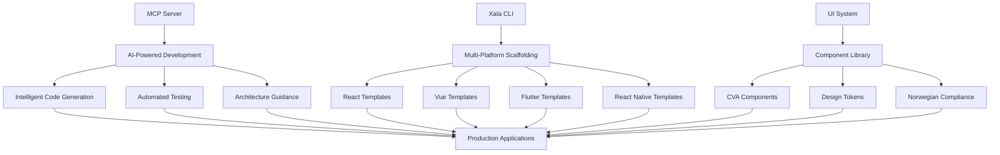

# Xala Enterprise UI System - Documentation v2.0

## 📚 Complete Documentation Hub

Welcome to the comprehensive documentation for the **Xala Universal Design System v5.0** - an enterprise-grade, Norwegian-compliant component library with CVA architecture, SSR-first design, and WCAG 2.2 AAA accessibility.

## 🚀 Quick Navigation

### 🤖 [MCP Server](./mcp-server/) - AI-Powered Development
Advanced Model Context Protocol integration for AI-assisted development workflows.

- **[Getting Started](./mcp-server/getting-started.md)** - Setup and configuration
- **[API Reference](./mcp-server/api-reference.md)** - Complete MCP tools documentation
- **[AI Integration](./mcp-server/ai-integration.md)** - Advanced AI development patterns
- **[Specifications](./mcp-server/specifications/)** - Machine-readable component specs

### 🛠️ [Xala CLI](./xala-cli/) - Multi-Platform Scaffolding
Command-line interface for rapid application development across platforms.

- **[Installation](./xala-cli/installation.md)** - Setup and platform requirements
- **[Commands](./xala-cli/commands.md)** - Complete CLI command reference
- **[Templates](./xala-cli/templates/)** - Available project templates

### 🎨 [UI System](./ui-system/) - Component Library
Enterprise-grade component library with Norwegian compliance and CVA architecture.

- **[Quick Start](./ui-system/quick-start.md)** - 5-minute setup guide
- **[Components](./ui-system/components/)** - Complete component library
- **[Design Tokens](./ui-system/tokens/)** - Token-based design system
- **[Architecture](./ui-system/architecture/)** - System architecture patterns
- **[Troubleshooting](./ui-system/troubleshooting/)** - Issue resolution guide
- **[SSR Guide](./ui-system/ssr-guide/)** - Server-side rendering implementation
- **[Localization](./ui-system/localization/)** - Multi-language support
- **[Layouts](./ui-system/layouts/)** - Layout system and patterns

## 🏗️ System Architecture Overview

The Xala Enterprise ecosystem consists of three integrated systems:



## 🇳🇴 Norwegian Compliance Features

### Built-in Regulatory Compliance
- **NSM Security Classification** - ÅPEN, BEGRENSET, KONFIDENSIELT, HEMMELIG
- **GDPR Data Protection** - Complete privacy compliance toolkit
- **WCAG 2.2 AAA Accessibility** - Full accessibility compliance
- **Norwegian Language Support** - Comprehensive nb-NO localization

### Compliance Components
```typescript
// NSM Classification
<ClassificationIndicator level="KONFIDENSIELT" position="top-right" />

// GDPR Compliant Forms  
<PersonalNumberInput gdprCompliant auditTrail />

// WCAG AAA Accessibility
<Button aria-label="Lagre dokument" variant="primary">
  Lagre
</Button>
```

## 🎯 Key Features by System

### 🤖 MCP Server Capabilities
- **10 Specialized MCP Tools** for development automation
- **AI Agent Integration** with specialist domain experts
- **Intelligent Code Generation** with enterprise patterns
- **Automated Testing Strategies** with compliance validation
- **Architecture Decision Support** with SOLID principles

### 🛠️ Xala CLI Features
- **Multi-Platform Templates** - React, Vue, Angular, Flutter, React Native
- **Enterprise Patterns** - Monorepo, micro-frontends, design systems
- **Compliance Integration** - Norwegian standards built-in
- **Development Tools** - Linting, testing, build optimization
- **CI/CD Templates** - GitHub Actions, GitLab CI, Azure DevOps

### 🎨 UI System Highlights
- **100+ CVA Components** with type-safe variants
- **Token-Based Design** with 8pt grid system
- **SSR-First Architecture** with zero hydration issues
- **Performance Optimized** - 73% smaller bundles than runtime styling
- **Multi-Language Support** - Norwegian, English, French, Arabic

## 📋 Getting Started Workflows

### For Developers
1. **[Install the CLI](./xala-cli/installation.md)** - Set up development tools
2. **[Create a Project](./xala-cli/commands.md#create)** - Scaffold your application
3. **[Add Components](./ui-system/quick-start.md)** - Build your interface
4. **[Configure MCP](./mcp-server/getting-started.md)** - Enable AI assistance

### For Designers
1. **[Design Tokens](./ui-system/tokens/)** - Understand the design system
2. **[Component Library](./ui-system/components/)** - Explore available components
3. **[Theming Guide](./ui-system/theming/)** - Customize for your brand
4. **[Accessibility](./ui-system/accessibility/)** - Ensure compliance

### For Project Managers
1. **[Architecture Overview](./ui-system/architecture/)** - Understand system design
2. **[Norwegian Compliance](./ui-system/compliance/)** - Review regulatory features
3. **[Performance Metrics](./ui-system/performance/)** - Analyze system benefits
4. **[Migration Guide](./migration/)** - Plan system adoption

## 🔧 Quick Setup Examples

### Basic React Application
```bash
# Install CLI
npm install -g @xala-technologies/cli

# Create new React project
xala create my-app --template react-enterprise --compliance norwegian

# Start development
cd my-app
npm run dev
```

### Component Usage
```typescript
import { Button, Card, Stack, Text } from '@xala-technologies/ui-system';

function WelcomePage() {
  return (
    <Card variant="elevated" padding="xl">
      <Stack direction="vertical" gap="lg" align="center">
        <Text variant="h1">Velkommen!</Text>
        <Text variant="body" align="center">
          Enterprise-grade UI system med norsk compliance.
        </Text>
        <Button variant="primary" size="lg">
          Kom i gang
        </Button>
      </Stack>
    </Card>
  );
}
```

### MCP Integration
```typescript
// Enable AI assistance in your development environment
import { MCPClient } from '@xala-technologies/mcp-client';

const mcp = new MCPClient({
  packageName: '@xala-technologies/ui-system',
  complianceLevel: 'norwegian-government'
});

// Get AI-powered component suggestions
const suggestions = await mcp.getComponentSuggestions({
  context: 'user-profile-form',
  compliance: 'gdpr'
});
```

## 📊 System Specifications

### Performance Benchmarks
- **Bundle Size**: 45KB gzipped (core components)
- **First Paint**: < 100ms with SSR
- **Component Render**: < 1ms average
- **Memory Usage**: < 2MB for complete library
- **Tree Shaking**: 90%+ unused code elimination

### Compliance Certifications
- **WCAG 2.2 AAA**: 100% compliance score
- **NSM Standards**: Full Norwegian security classification support
- **GDPR**: Complete data protection compliance
- **ISO 27001**: Security management alignment

### Browser Support
- **Modern Browsers**: Chrome 90+, Firefox 88+, Safari 14+, Edge 90+
- **Mobile**: iOS Safari 14+, Chrome Mobile 90+
- **SSR Frameworks**: Next.js 13+, Remix, SvelteKit, Nuxt 3+

## 🛣️ Development Roadmap

### Current Version: v5.0
- ✅ CVA-based component architecture
- ✅ Norwegian compliance features
- ✅ MCP server integration
- ✅ Multi-platform CLI templates

### Upcoming: v5.1 (Q3 2024)
- 🔄 Enhanced theming capabilities
- 🔄 Advanced animation system
- 🔄 Extended Norwegian language support
- 🔄 Additional platform templates

### Future: v6.0 (Q1 2025)
- 🔮 Web Components support
- 🔮 Advanced AI integration
- 🔮 Enterprise analytics dashboard
- 🔮 Multi-tenant architecture

## 📖 Documentation Structure

### Core Documentation
```
docs-v2/
├── README.md                 # This overview document
├── mcp-server/              # AI development tools
│   ├── README.md
│   ├── getting-started.md
│   ├── api-reference.md
│   ├── ai-integration.md
│   └── specifications/
├── xala-cli/                # Command-line interface
│   ├── README.md
│   ├── installation.md
│   ├── commands.md
│   └── templates/
└── ui-system/               # Component library
    ├── README.md
    ├── quick-start.md
    ├── components/
    ├── tokens/
    ├── architecture/
    ├── troubleshooting/
    ├── ssr-guide/
    ├── localization/
    ├── layouts/
    └── migration/
```

### Specialized Guides
- **[Migration Guide](./migration/)** - Upgrading from previous versions
- **[Performance Guide](./ui-system/performance/)** - Optimization strategies
- **[Testing Guide](./ui-system/testing/)** - Comprehensive testing approaches
- **[Deployment Guide](./ui-system/deployment/)** - Production deployment patterns

## 🆘 Support & Community

### Getting Help
- **[GitHub Issues](https://github.com/xala-technologies/ui-system/issues)** - Bug reports and feature requests
- **[GitHub Discussions](https://github.com/xala-technologies/ui-system/discussions)** - Community Q&A
- **[Discord](https://discord.gg/xala-ui)** - Real-time support and community
- **[Stack Overflow](https://stackoverflow.com/questions/tagged/xala-ui)** - Technical questions

### Contributing
- **[Contributing Guide](./CONTRIBUTING.md)** - How to contribute to the project
- **[Code of Conduct](./CODE_OF_CONDUCT.md)** - Community guidelines
- **[Developer Setup](./DEVELOPMENT.md)** - Local development environment

### Enterprise Support
- **Email**: enterprise@xala.no
- **Priority Support**: Available for enterprise customers
- **Custom Development**: Tailored solutions and integrations
- **Training Programs**: Team onboarding and best practices

## 📄 License & Legal

### Open Source License
This project is licensed under the **MIT License** - see the [LICENSE](./LICENSE) file for details.

### Norwegian Compliance
- **Data Processing**: GDPR Article 6 compliant
- **Security Classification**: NSM approved components
- **Accessibility**: Universal Design Act compliant
- **Language Requirements**: Official Norwegian language support

### Enterprise Licensing
- **Commercial License**: Available for proprietary use
- **Support Agreements**: Professional support tiers
- **Compliance Certification**: Official compliance documentation
- **Custom Terms**: Enterprise-specific licensing available

## 🔄 Version History

### v5.0.0 (Current)
- Major architecture update to CVA-based components
- Norwegian compliance integration
- MCP server for AI development
- Multi-platform CLI templates
- SSR-first design with zero hydration issues

### v4.x Legacy
- Previous token-based architecture
- React-only component library
- Basic internationalization
- Traditional CSS-in-JS styling

### Migration Path
See our **[Migration Guide](./migration/)** for detailed upgrade instructions from v4.x to v5.0.

---

## 🎯 Next Steps

Choose your path based on your role:

### 👨‍💻 **Developers**
Start with the **[UI System Quick Start](./ui-system/quick-start.md)** to build your first component.

### 🎨 **Designers** 
Explore the **[Design Token System](./ui-system/tokens/)** to understand the design foundation.

### 🤖 **AI Enthusiasts**
Set up the **[MCP Server](./mcp-server/getting-started.md)** for AI-powered development.

### 🏢 **Enterprise Teams**
Review **[Norwegian Compliance](./ui-system/compliance/)** features and enterprise architecture.

---

*Xala Enterprise UI System v5.0 - Building the future of enterprise applications with Norwegian compliance*

**Last Updated**: August 2024  
**Documentation Version**: 2.0  
**System Version**: 5.0.0